# Lab 1: Simple Deployment via Amazon LightSail

**Status:** ✅ Complete

**Date Completed:** April 29, 2026

**Reference:** [AWS Network Challenge 2 by Raphael Jambalos](https://dev.to/raphael_jambalos/aws-network-challenge-2-deploy-a-file-uploading-app-on-ec2-rds-documentdb-16eb)

---

## 🔹 Overview

Lab 1 is where everything begins. Before touching VPCs, managed 
databases, or auto-scaling, Sir Raphael's challenge starts with the 
most honest question in cloud deployment: can you just get the thing 
running?

The answer is yes, but getting it running is only the beginning. Lab 1 
is not a single deployment. It is a progression of three architectures, 
each one exposing a weakness in the previous one, and each improvement 
setting up the next problem to solve. Sir Raphael structures it this 
way deliberately in his original article, and building it myself made 
clear why. Every limitation you discover by actually running the 
architecture is more memorable than any diagram.

The first architecture puts everything on one server. Simple, but a
single point of failure.

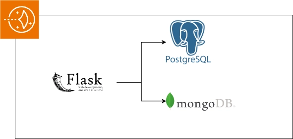

*Source: [Raphael Jambalos — AWS Network Challenge 2](https://dev.to/raphael_jambalos/aws-network-challenge-2-deploy-a-file-uploading-app-on-ec2-rds-documentdb-16eb)*

The second architecture separates each component onto its own dedicated
server. The app and databases can now fail independently, but the
databases themselves still have no redundancy.

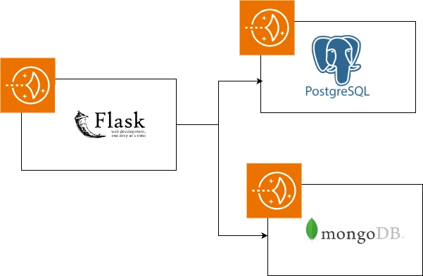

*Source: [Raphael Jambalos — AWS Network Challenge 2](https://dev.to/raphael_jambalos/aws-network-challenge-2-deploy-a-file-uploading-app-on-ec2-rds-documentdb-16eb)*

The third architecture adds a secondary server for each database with
live replication. Every write to the primary is immediately copied to
the secondary. If a primary goes down, the data survives.

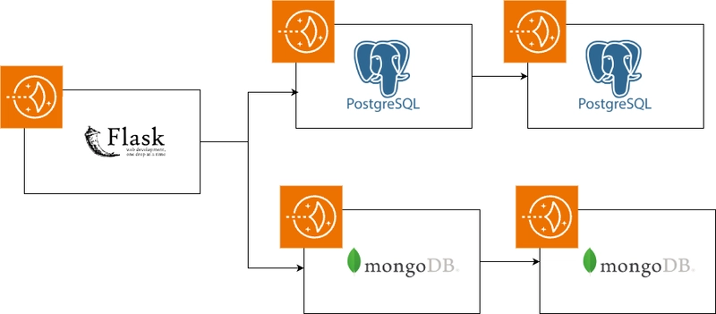

*Source: [Raphael Jambalos — AWS Network Challenge 2](https://dev.to/raphael_jambalos/aws-network-challenge-2-deploy-a-file-uploading-app-on-ec2-rds-documentdb-16eb)*

I started with the simplest possible setup, discovered its limitations,
improved it, discovered new limitations, and improved it again. By the
end of Lab 1, I had five LightSail servers running, and two databases with
active replication.

---

## 🔹 Goal

Deploy the Flask photo eCommerce application using Amazon LightSail, 
starting from the simplest possible single-server configuration and 
progressively improving it to address each weakness discovered, ending 
with a five-server architecture featuring native database replication 
for both MongoDB and PostgreSQL.

---

## 🔹 What I Built

### Starting Simple: Everything on One Server

- 1 LightSail instance (`flask-photo-app-server`, Amazon Linux 2, 
  $5/month plan)
- MongoDB 6.0 installed directly on the instance
- PostgreSQL 14 installed directly on the instance
- Flask app cloned from 
  [jamby1100/file-upload-flask](https://github.com/jamby1100/file-upload-flask)
- Python 3.8 virtual environment with all dependencies installed
- tmux session to keep Flask running after SSH disconnect
- Port 5000 opened in LightSail firewall

### Separating the Components: Three Servers

- 1 existing LightSail instance repurposed as the Flask app server
- 1 new LightSail instance (`mongodb-server`, Amazon Linux 2, 
  $5/month plan)
- 1 new LightSail instance (`postgresql-server`, Amazon Linux 2, 
  $5/month plan)
- MongoDB configured to accept remote connections (`bindIp: 0.0.0.0`)
- PostgreSQL configured for remote access (`listen_addresses = '*'`, 
  updated `pg_hba.conf`)
- Port 27017 opened on `mongodb-server` firewall
- Port 5432 opened on `postgresql-server` firewall
- Flask environment variables updated to point to private IPs of 
  separate servers

### Adding Redundancy: Five Servers with Replication

- 1 new LightSail instance (`mongodb-secondary`, Amazon Linux 2, 
  $5/month plan)
- 1 new LightSail instance (`postgresql-secondary`, Amazon Linux 2, 
  $5/month plan)
- MongoDB Replica Set `rs0` configured across `mongodb-server` and 
  `mongodb-secondary`
- PostgreSQL streaming replication configured using WAL (Write-Ahead 
  Log) between `postgresql-server` and `postgresql-secondary`
- `pg_basebackup` used to seed the secondary with primary data
- `standby.signal` confirmed on secondary, verifying replication is 
  active

---

## 🔹 Code Integration

The application is Sir Raphael's Flask app from 
[jamby1100/file-upload-flask](https://github.com/jamby1100/file-upload-flask). 
The entry point is `main.py`, which defines four routes and connects 
to both databases on every upload request.

The app reads all configuration from environment variables. Nothing 
is hardcoded. This is what made it possible to move from one 
architecture to the next without changing a single line of code. Only 
the environment variables changed.

| Variable | Single Server Value | Three/Five Server Value |
|---|---|---|
| `UPLOAD_DIRECTORY` | `/tmp` | `/tmp` |
| `MONGODB_DB_CONNECTION_URI` | `mongodb://localhost:27017/` | `mongodb://172.26.9.223:27017/` |
| `MONGODB_DB_NAME` | `ecv-jmp-file-upload-app` | `ecv-jmp-file-upload-app` |
| `ENV_MODE` | `frontend` | `frontend` |
| `POSTGRESQL_DB_HOST` | `localhost` | `172.26.14.190` |
| `POSTGRESQL_DB_DATABASE_NAME` | `ecv_file_upload_app_psql` | `ecv_file_upload_app_psql` |
| `POSTGRESQL_DB_USERNAME` | `flask_photo_app_admin` | `flask_photo_app_admin` |
| `POSTGRESQL_DB_PASSWORD` | `sac2c2qec1131DSq@#1` | `sac2c2qec1131DSq@#1` |

One important setup step was running `db/postgresql/init_db.py` after 
each new PostgreSQL server was provisioned. This script creates the 
`products` and `stock_movements` tables. Without it, the app crashes 
the moment anyone tries to upload a photo because the tables do not 
exist yet.

---

## 🔹 My Experience

### Starting Simple: Everything on One Server

I started on April 25, 2026, by creating a single LightSail instance 
named `flask-photo-app-server`. LightSail is Amazon's simplified 
server product. Unlike EC2, it gives you a server with a fixed monthly 
price and a simpler setup interface. For a first deployment, it made 
sense to start here.

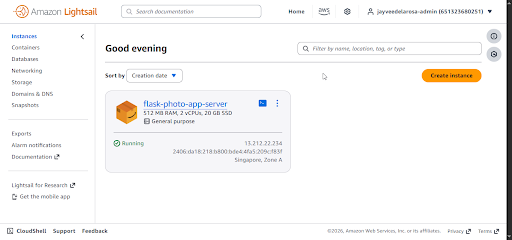

*`flask-photo-app-server` showing Running status in the LightSail dashboard*

The setup involved installing MongoDB 6.0 and PostgreSQL 14 directly 
on the same server as the Flask app, then cloning the repository, 
creating a Python virtual environment, and running the app.

The first real problem appeared immediately during dependency 
installation. Running `pip install -r requirements.txt` failed because 
the server came with Python 3.7 by default, but `blinker==1.8.2`, one 
of Flask's dependencies, requires Python 3.8 or higher.

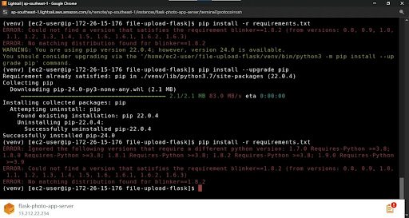

*`pip install -r requirements.txt` failing because Python 3.7 cannot satisfy blinker==1.8.2*

The fix was to install Python 3.8 using `amazon-linux-extras`, then 
recreate the virtual environment using `python3.8 -m venv venv`. After 
that, all dependencies installed without issues.

Configuring PostgreSQL required editing `pg_hba.conf` to change the 
authentication method from `ident` and `peer` to `md5`, which allows 
password-based login. The nano editor inside the LightSail browser 
terminal made this more challenging than expected since some keyboard 
shortcuts like `Ctrl+W` close the browser tab instead of triggering 
the search function.

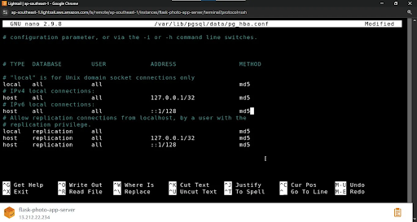

*`pg_hba.conf` with all authentication methods changed to `md5`*

After setting all eight environment variables and running 
`db/postgresql/init_db.py` to initialize the database tables, Flask 
started successfully.

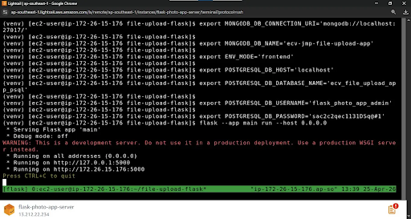

*Flask running on `0.0.0.0:5000` inside a tmux session on 
`flask-photo-app-server`*

I used tmux to keep Flask alive after closing the SSH session. Without 
tmux, the Flask process terminates the moment the browser tab is 
closed.

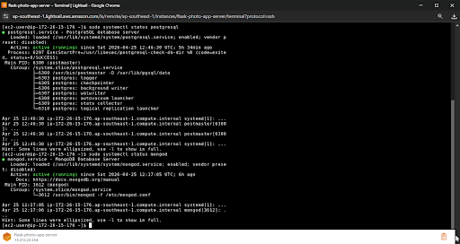

*Both MongoDB and PostgreSQL showing `active (running)` on the same server*

The app was accessible at `http://13.212.22.234:5000` after opening 
port 5000 in the LightSail firewall.

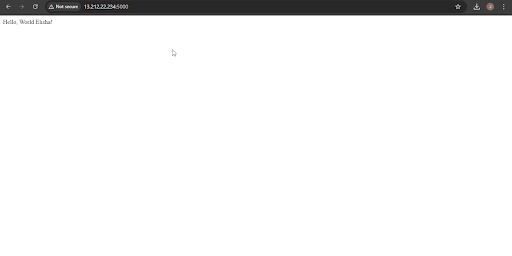

*The Flask app returning Hello World at the root route*

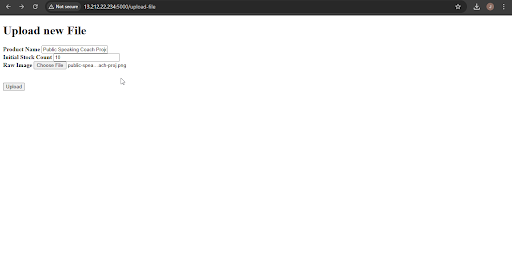

*The upload form at `/upload-file`*

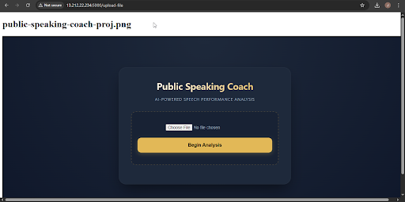

*A successful upload showing the filename and image returned by Flask*

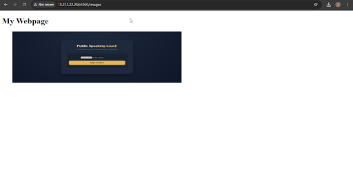

*The `/images` page retrieving uploaded image metadata from MongoDB*

This setup works, but its weakness is obvious. Everything lives on one 
machine. If that server goes down, the app goes down, the database goes 
down, and all data is gone with it. Sir Raphael calls this a single 
point of failure, and building it made the problem concrete.

---

### Separating the Components: Three Servers

The next step was to give each component its own dedicated server. I created two new LightSail instances: `mongodb-server` 
and `postgresql-server`.

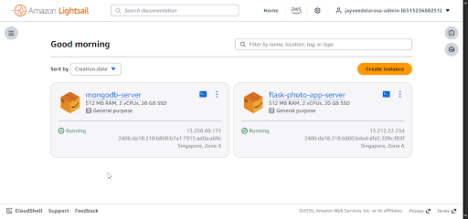

*`mongodb-server` instance created and showing Running status*

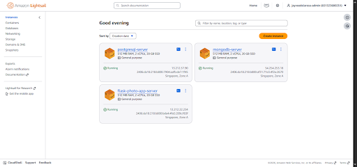

*All three LightSail instances running: `flask-photo-app-server`, 
`mongodb-server`, and `postgresql-server`*

This step introduced a new challenge: hitting the LightSail instance 
quota. On April 25, when I tried to create `postgresql-server`, AWS blocked the 
creation and showed a quota increase request dialog. My account had a 
limit of 10 instances at the account level, but the applied limit was 
lower. I submitted a quota increase request through the Service Quotas 
console, requesting an increase to 40, to give enough room for all 
remaining setups. My request was approved at noon on April 28.

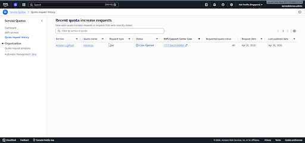

*Quota increase request submitted through AWS Service Quotas console*

Installing MongoDB on `mongodb-server` required creating the MongoDB 
6.0 repository file manually, installing the package, and then 
editing `/etc/mongod.conf` to change `bindIp` from `127.0.0.1` to 
`0.0.0.0`. This is the step that allows MongoDB to accept connections 
from servers other than itself.

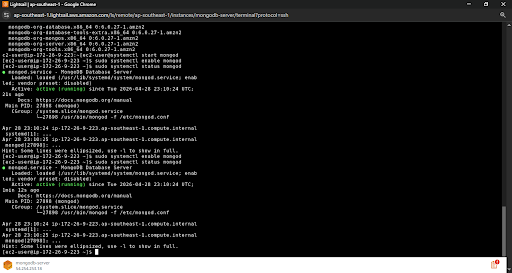

*MongoDB showing `active (running)` on `mongodb-server`*

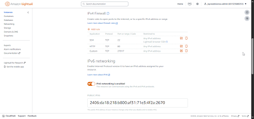

*Port 27017 opened in the `mongodb-server` LightSail firewall*

Setting up `postgresql-server` followed the same pattern as the 
original PostgreSQL setup, with two additional configurations. First, 
`postgresql.conf` needed `listen_addresses = '*'` to accept connections 
from other servers. Second, `pg_hba.conf` needed a new line allowing 
connections from any IP address: `host all all 0.0.0.0/0 md5`.

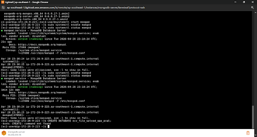

*PostgreSQL showing `active (running)` on `postgresql-server`*

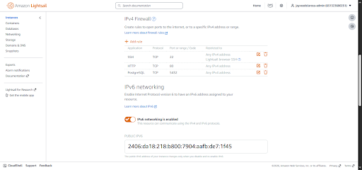

*Port 5432 opened in the `postgresql-server` LightSail firewall*

After both database servers were running, I updated the Flask 
environment variables on `flask-photo-app-server` to point to the 
private IP addresses of the new servers instead of `localhost`. Private 
IPs were used because all three servers are in the same AWS region, 
allowing free server-to-server communication without going through the 
public internet.

I also ran `db/postgresql/init_db.py` again, this time pointing at the 
new `postgresql-server`, to create the tables on the fresh database.

The app continued working exactly as before, with no code changes 
required. Only the environment variables changed.

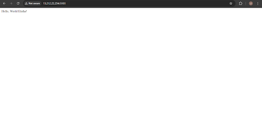

*Flask app accessible at `http://13.212.22.234:5000` with databases 
on separate servers*

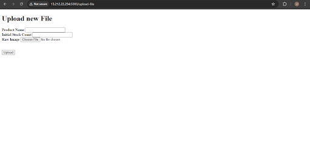

*Upload form working, with files saving to `mongodb-server` and 
`postgresql-server`*

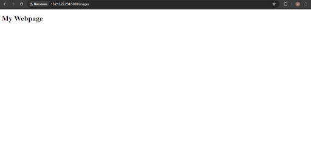

*Images page retrieving data from the dedicated `mongodb-server`*

This architecture is better. If the Flask app server crashes, the 
databases survive. But the database servers themselves still have no 
redundancy. If `mongodb-server` or `postgresql-server` goes down, that 
data is gone. The next step was to fix that.

---

### Adding Redundancy: Five Servers with Replication

The final configuration adds a secondary server for each database. On 
April 29, 2026, I created two more LightSail instances: 
`mongodb-secondary` and `postgresql-secondary`.

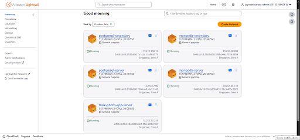

*`mongodb-secondary` and `postgresql-secondary` created alongside the 
existing three servers*

**MongoDB Replication**

MongoDB replication uses a Replica Set, a group of MongoDB servers 
that keep their data synchronized. I configured both `mongodb-server` 
and `mongodb-secondary` with the same `replSetName: "rs0"` in their 
`mongod.conf` files, then initialized the replica set from the primary 
using `mongosh`.

Setting up `mongodb-secondary` introduced a configuration typo that 
caused MongoDB to fail on startup. The error message was:

```
Unrecognized option: replication.replSetNae 
```

I had typed `replSetNae` instead of `replSetName`. The `m` at the end 
was missing. One letter caused a full service failure. The fix was to 
use `sed` to remove the broken line and rewrite it correctly.

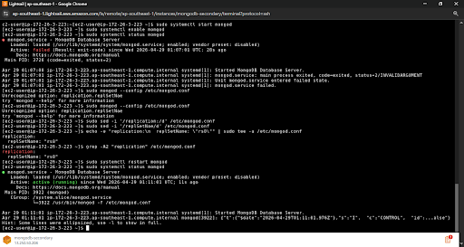

*MongoDB running on `mongodb-secondary` after fixing the config typo*

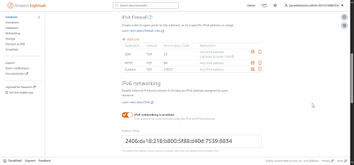

*Port 27017 opened on `mongodb-secondary` firewall*

After initializing the replica set, `rs.status()` confirmed both 
servers were connected, with one showing `PRIMARY` and the other 
showing `SECONDARY`.

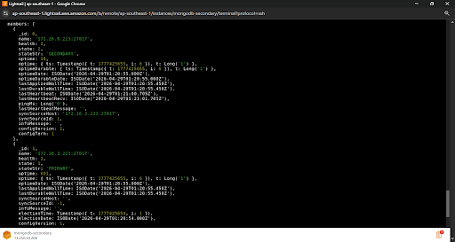

*`rs.status()` output showing one member as `PRIMARY` and one as 
`SECONDARY`, confirming active replication*

**PostgreSQL Replication**

PostgreSQL replication uses WAL (Write-Ahead Log), a mechanism where 
every change to the primary database is written to a log first. The 
secondary server reads that log and applies the same changes, keeping 
both servers in sync.

Configuring the primary required three changes to `postgresql.conf`:

```
wal_level = replica
max_wal_senders = 3
wal_keep_size = 64 
```

The `wal_keep_size` setting also caused a startup failure due to a 
manual typo. I had typed `wal_keep_siz` instead of `wal_keep_size`, 
missing the final `e`. PostgreSQL refused to start with the error:

```
unrecognized configuration parameter "wal_keep_siz"
```

Again, the fix was to use `sed` to reset the line and reapply it correctly.

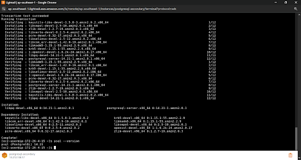

*PostgreSQL running on `postgresql-secondary`*

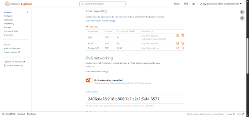

*Port 5432 opened on `postgresql-secondary` firewall*

I used `pg_basebackup` on the secondary to copy the entire primary 
database as the starting point for replication. The `-R` flag 
automatically created the `standby.signal` file, which tells 
PostgreSQL it is a replica and should follow the primary.

I confirmed replication through the presence of `standby.signal`:

```bash
sudo ls /var/lib/pgsql/data/ | grep standby
```

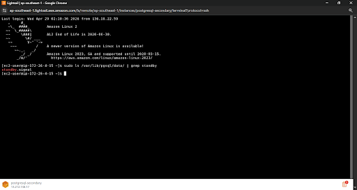

*`standby.signal` present in the PostgreSQL data directory on 
`postgresql-secondary`, confirming active replication*

With five servers running and both databases replicating, Lab 1 was 
complete. The architecture had evolved from a single fragile server to 
a setup where each component has its own dedicated machine and each 
database has a live backup copy.

---

## 🔹 Final Verification

The final working state of Lab 1 was the three-server configuration 
with replication active in the background. The Flask app remained 
accessible through the original server at `http://13.212.22.234:5000`.


*Flask app accessible and serving traffic with databases on separate 
dedicated servers*


*Upload form accepting submissions, saving files to disk, metadata to 
`mongodb-server`, and product data to `postgresql-server`*


*Images page successfully retrieving metadata from `mongodb-server`*

---

## 🔹 Errors and Fixes Summary

| Error | Setup | Cause | Fix |
|---|---|---|---|
| `pip install -r requirements.txt` failing on `blinker==1.8.2` | Single Server | Amazon Linux 2 ships with Python 3.7, but blinker 1.8.2 requires Python 3.8+ | Installed Python 3.8 via `amazon-linux-extras`, recreated virtual environment with `python3.8 -m venv venv` |
| `sudo systemcl restart postgresql` command not found | Single Server | Typo: `systemcl` instead of `systemctl` | Retyped with correct spelling |
| LightSail instance quota exceeded when creating `postgresql-server` | Three Servers | Account-level quota was lower than the AWS default | Submitted quota increase request through Service Quotas console, requesting increase to 40 |
| MongoDB failing to start on `mongodb-secondary` | Five Servers | Config typo: `replSetNae` instead of `replSetName` | Used `sed` to remove the broken line and rewrite it correctly |
| PostgreSQL failing to start on `postgresql-server` after WAL config | Five Servers | Config typo: `wal_keep_siz` instead of `wal_keep_size` | Used `sed` to reset the line to default and reapply the correct value |

---

## 🔹 Key Learnings

**1. The simplest architecture teaches the most.**

Building everything on one server first made the problems with that 
approach immediate and real. Reading about single points of failure in 
a diagram is not the same as actually having your entire app depend on 
one machine. Lab 1's progression from one server to five was the most 
effective way to understand why distributed architecture exists.

**2. Environment variables are the bridge between code and infrastructure.**

The Flask app never changed. Not one line of `main.py` was modified 
across all three configurations. What changed was where the environment 
variables pointed. This taught me that well-written application code 
should not care where it is deployed. The infrastructure adapts around 
it.

**3. Config file precision is non-negotiable.**

Two separate service failures in Lab 1 were caused by single missing 
letters in configuration files. `replSetNae` and `wal_keep_siz` each 
brought down a database service completely. The lesson is to use 
automated commands like `sed` for config edits whenever possible, and 
to always verify changes with `grep` before restarting a service.

**4. Private IPs are the right way for servers to talk to each other.**

When the Flask app needed to connect to `mongodb-server` and 
`postgresql-server`, I used private IP addresses rather than public 
ones. Private IPs are free, faster, and never leave the AWS network. 
This is the correct approach for server-to-server communication within 
the same region.

**5. AWS service limits are real and require planning.**

Hitting the LightSail instance quota mid-setup was unexpected. In a 
real project, this kind of limit would delay a deployment. The lesson 
is to check and request quota increases before starting a build that 
requires multiple resources, not during it.

---

## 🔹 Cleanup Planned

All five LightSail servers are currently still running. They will be 
kept until Labs 1 through 6 are fully built, documented, and presented 
to Sir Raphael. After that, all instances will be deleted.

---

## 🔹 What's Next

Lab 1 demonstrated the limits of managing everything manually. Even 
with three servers and replication, I had to configure bindIp settings, 
edit pg_hba.conf, set up WAL parameters, and run pg_basebackup by hand. 
Any mistake in any of those steps breaks the whole thing, as the typos 
proved.

Lab 2 moves the entire architecture into a proper AWS network using 
Amazon VPC. Instead of publicly accessible LightSail servers, the 
databases move into a private subnet that cannot be reached from the 
internet at all. Only the proxy server is public. This is the 
foundation of how real cloud applications are secured.

---

*Documentation by Jayvee Dela Rosa | Based on the AWS Network 
Challenge 2 by [Raphael Jambalos](https://dev.to/raphael_jambalos/aws-network-challenge-2-deploy-a-file-uploading-app-on-ec2-rds-documentdb-16eb)*

