# Lab 2: Deploy to Amazon VPC

**Status:** ✅ Complete
**Date Completed:** April 26, 2026
**Reference:** [AWS Network Challenge 2 by Raphael Jambalos](https://dev.to/raphael_jambalos/aws-network-challenge-2-deploy-a-file-uploading-app-on-ec2-rds-documentdb-16eb)

---

## 🔹 Overview

Lab 2 is where the architecture becomes real. In Lab 1, everything ran on a single server, it is  simple, but fragile and exposed. Lab 2 fixes that by introducing a proper AWS network using **Amazon VPC**, separating the application from its databases, and hiding everything sensitive inside a **private subnet**.

This lab taught me what it actually means to architect a secure cloud application, not just deploy one.

Architecture reference from Sir Raphael's original article:

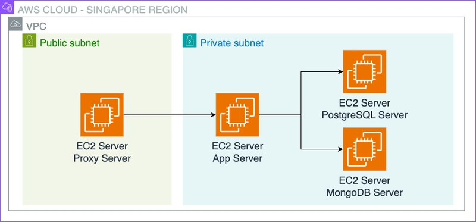
*Source: [Raphael Jambalos — AWS Network Challenge 2](https://dev.to/raphael_jambalos/aws-network-challenge-2-deploy-a-file-uploading-app-on-ec2-rds-documentdb-16eb)*

---

## 🔹 Goal

Move the Flask application from a single public LightSail server into a proper, secure AWS network where:
- Only the **Proxy Server** is publicly accessible
- The **App Server**, **MongoDB Server**, and **PostgreSQL Server** are hidden in a private subnet
- All traffic from the internet is routed through **Nginx** on the Proxy Server

---

## 🔹 What I Built

**AWS Resources Created:**
- 1 VPC (`10.0.0.0/16`)
- 2 Subnets (public + private)
- 1 Internet Gateway
- 2 Route Tables
- 4 Security Groups
- 1 Key Pair
- 4 EC2 Instances (Amazon Linux 2023)
- 1 NAT Gateway (temporary - deleted after setup)
- Nginx as reverse proxy

---

## 🔹 Code Integration

The same Flask application from Lab 1 (`main.py`) runs on the App Server EC2. The key difference is where the environment variables point:

| Variable | Lab 1 Value | Lab 2 Value |
|---|---|---|
| `MONGODB_DB_CONNECTION_URI` | `mongodb://localhost:27017/` | `mongodb://10.0.2.166:27017/` |
| `POSTGRESQL_DB_HOST` | `localhost` | `10.0.2.239` |
| `UPLOAD_DIRECTORY` | `/tmp` | `/tmp` (same for now) |

Instead of everything being on one machine, each environment variable now points to a **separate private EC2 server** inside the VPC.

---

## 🔹 My Experience

### Setting Up the Network (VPC, Subnets, IGW, Route Tables)

I started by building the network infrastructure from scratch using the AWS VPC Console. This was my first time creating a VPC manually, and the number of components surprised me. I had to create not just the VPC itself, but subnets, an internet gateway, and route tables, each a separate step that had to be done in the right order.

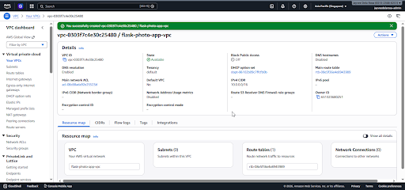
*The VPC `flask-photo-app-vpc` with CIDR `10.0.0.0/16` successfully created*

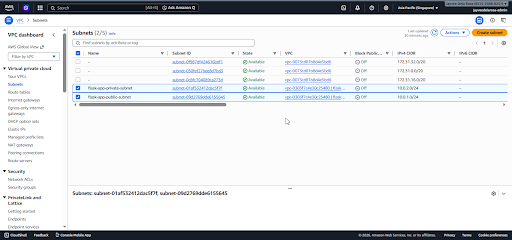
*Public subnet (`10.0.1.0/24`) and private subnet (`10.0.2.0/24`) created in the same AZ*

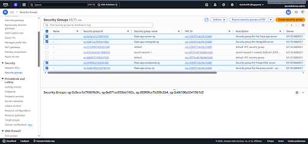
*Internet Gateway attached to `flask-photo-app-vpc`*

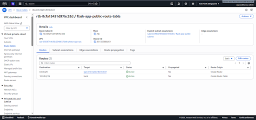
*Public route table with `0.0.0.0/0 → IGW` - this is what makes the public subnet actually public*

---

### Setting Up Security Groups

Creating security groups was one of the most important parts of this lab. Each server gets its own security group with specific rules about who can talk to it and on which port.

The most powerful concept I learned here was **security group referencing**, instead of allowing a specific IP address, you can allow another security group as the source. For example, the MongoDB security group only allows port 27017 from `flask-app-server-sg`, meaning only the App Server can ever reach MongoDB, regardless of what IP it has.


*All 4 security groups created - one per server role*

---

### Launching EC2 Instances

I launched 4 EC2 instances, each with different network settings. The Proxy Server went into the public subnet with a public IP enabled. The other three went into the private subnet with no public IP, completely hidden from the internet.

During this step I encountered my first real-world adaptation: **Amazon Linux 2 is no longer available** as a Quick Start AMI in 2026. AWS has moved to Amazon Linux 2023 as the default. This meant all the `yum` commands in the original instructions had to be replaced with `dnf`

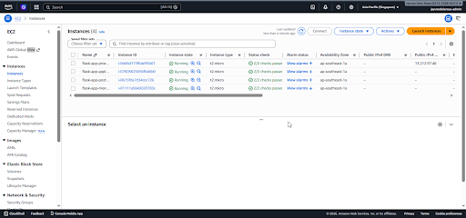
*All 4 EC2 instances running - Proxy in public subnet, the rest in private subnet*

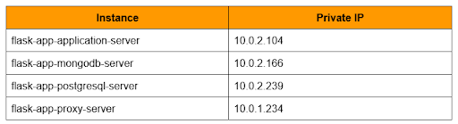
*Private IP addresses of each server - these are used to connect the app to its databases*

---

### The Private Subnet Internet Access Problem

This was the biggest challenge of Lab 2 and one I didn't anticipate.

When I tried to install MongoDB on the MongoDB Server, I discovered that **private subnet servers have no internet access by default**. They cannot download packages from the internet. Every `dnf install` command timed out.

The solution was to create a **NAT Gateway**, a service that lets private servers reach the internet for outbound requests (like downloading software) without being reachable from the internet themselves.

After creating the NAT Gateway and adding a route in the private route table, internet access worked immediately on all private servers.

> **Important:** NAT Gateways cost approximately $0.045/hour. I created it only for the duration of software installation and deleted it immediately after all three private servers were fully configured.

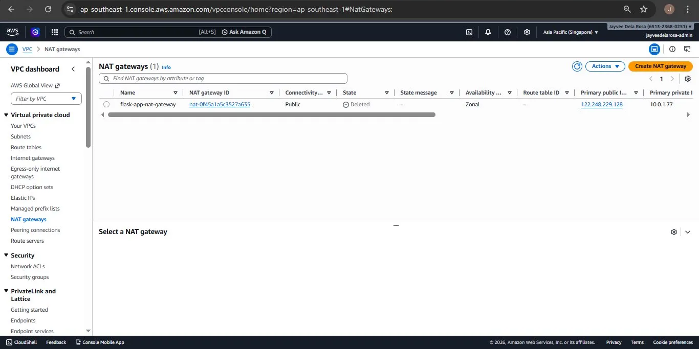
*NAT Gateway deleted after use - showing "Deleted" status*

---

### The SSH Jump Pattern

Another challenge was connecting to private servers. Since they have no public IP, I cannot SSH into them directly from my laptop. The solution is to SSH into the Proxy Server first, then SSH from the Proxy Server into the private server. This is called the **Bastion Host** pattern.

The command chain looks like this:
Local Computer (Windows CMD)
↓ ssh -i flask-app-keypair.pem ec2-user@13.212.97.46
Proxy Server [ec2-user@ip-10-0-1-234]
↓ ssh -i ~/.ssh/flask-app-keypair.pem ec2-user@10.0.2.166
MongoDB Server [ec2-user@ip-10-0-2-166]

I also learned the importance of always checking my terminal prompt before running commands. I accidentally ran MongoDB configuration commands on the Proxy Server instead of the MongoDB Server because I lost track of which server I was on. After that mistake, I made it a habit to always check the IP in my prompt before running any command.

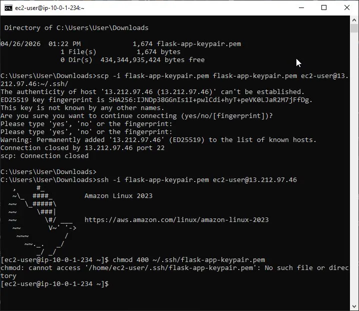
*Successfully copying the key file to the Proxy Server using SCP - a necessary step for the SSH jump pattern*

---

### MongoDB 6.0 vs MongoDB 7.0

The original instructions referenced MongoDB 6.0. When I tried to install it on Amazon Linux 2023, I got a wall of errors:

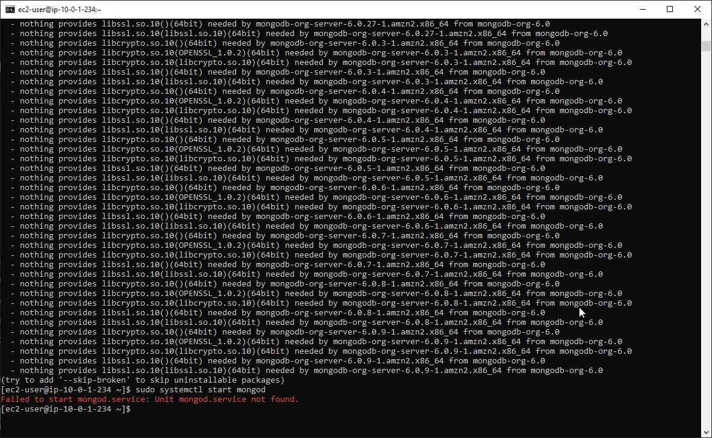
*MongoDB 6.0 installation failing on Amazon Linux 2023 - missing `libssl.so.10` which is an older library not included in AL2023*

The root cause: MongoDB 6.0 was compiled for Amazon Linux 2 and depends on older SSL libraries (`libssl.so.10`) that Amazon Linux 2023 does not include.

The fix was to use **MongoDB 7.0**, which has a dedicated Amazon Linux 2023 repository:
baseurl=https://repo.mongodb.org/yum/amazon/2023/mongodb-org/7.0/x86_64/
Another issue was that the `mongod.conf` file was completely empty after the failed installation attempts:

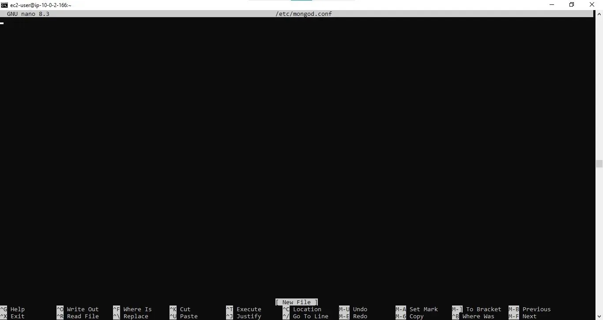
*Empty `mongod.conf` - the file existed but had no content because the installation was interrupted*

The fix was to create the config file from scratch using `tee`, with `bindIp: 0.0.0.0` already set - so MongoDB would accept connections from other servers inside the VPC.

After switching to MongoDB 7.0 and creating the config manually:

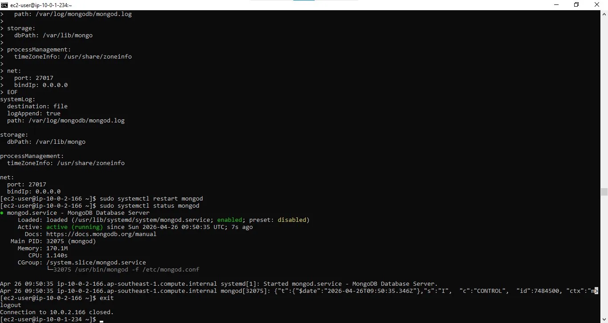
*MongoDB 7.0 running successfully on Amazon Linux 2023 - `active (running)`*

---

### Configuring PostgreSQL

PostgreSQL installation was more straightforward once the NAT Gateway was in place. The key configurations were:

**In `pg_hba.conf`:** Changed authentication from `ident` to `md5` and added a new line allowing the entire private subnet to connect with a password:

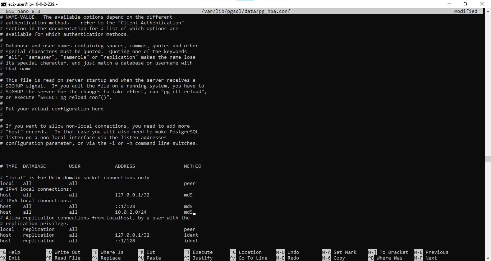
*`pg_hba.conf` with `md5` authentication and `10.0.2.0/24` subnet rule added*

**In `postgresql.conf`:** Changed `listen_addresses` from `localhost` to `*` so PostgreSQL accepts connections from other servers:

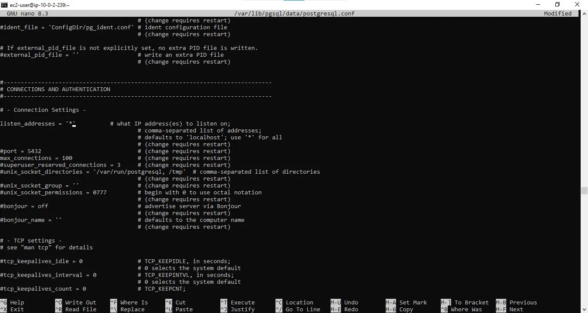
*`listen_addresses = '*'` - allows PostgreSQL to accept connections from the App Server*

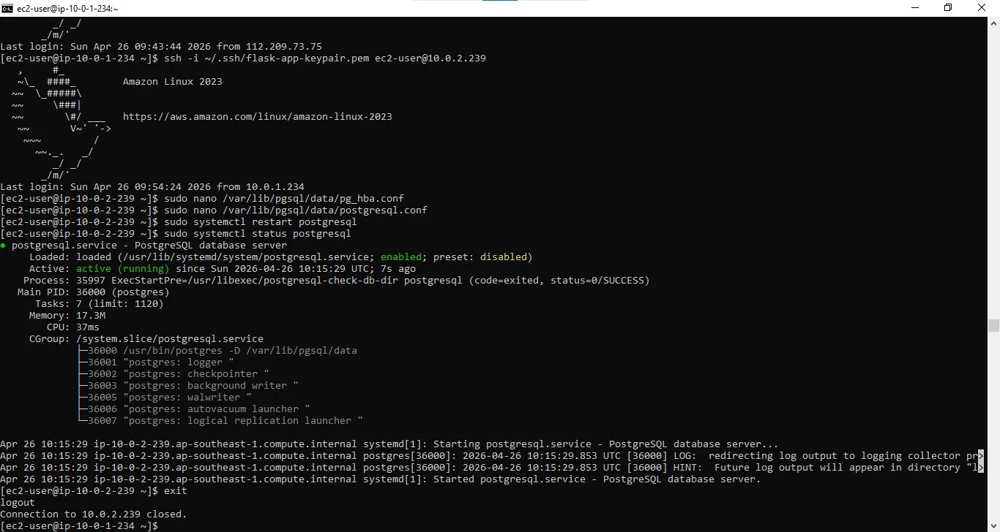
*PostgreSQL running successfully with all configurations applied*

---

### Running the Flask App

After configuring all three database servers, I set up the App Server by cloning the repository, creating a virtual environment, and installing all dependencies from `requirements.txt`.

The most important step here was setting environment variables that pointed to the correct private IP addresses of the MongoDB and PostgreSQL servers - replacing `localhost` with actual private IPs inside the VPC.

I used `tmux` to keep Flask running in the background even after detaching from the SSH session:

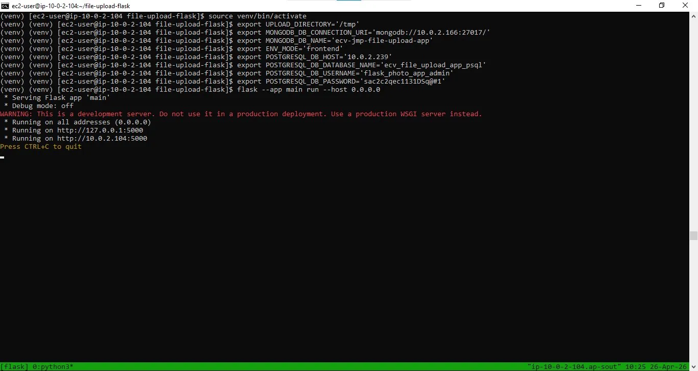
*Flask running on `0.0.0.0:5000` inside a tmux session - the green bar at the bottom confirms tmux is active*

---

### Nginx as Reverse Proxy

The final piece was configuring Nginx on the Proxy Server. Nginx listens on port 80 (standard HTTP) and forwards all requests to the App Server on port 5000. This means users visit the Proxy Server's public IP without specifying a port.

```nginx
server {
    listen 80;
    location / {
        proxy_pass http://10.0.2.104:5000;
    }
}
```

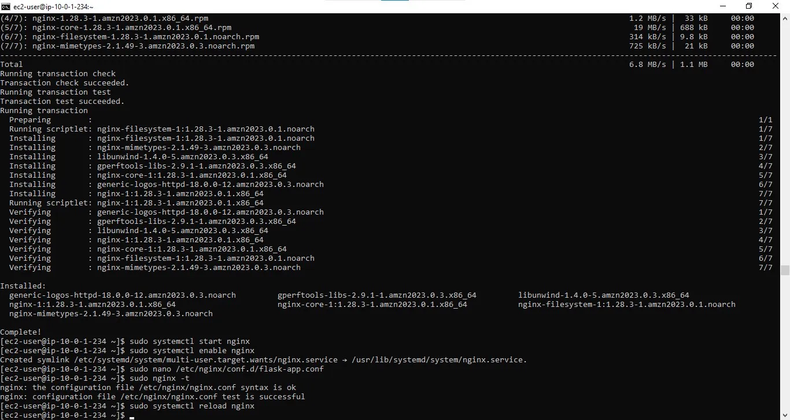
*`nginx: configuration file test is successful` - confirming the Nginx config has no errors*

---

## 🔹 Final Verification

After all configurations were complete, I tested the application through the Proxy Server's public IP:

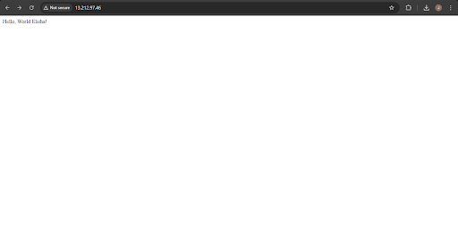
*Flask app accessible via `http://13.212.97.46` - routed through Nginx on the Proxy Server*

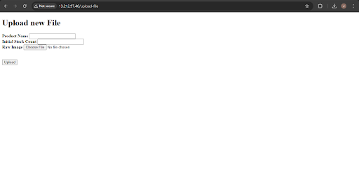
*Upload form working - file uploads save to disk, metadata to MongoDB, product data to PostgreSQL*

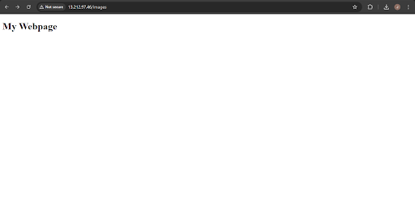
*Images page working - successfully retrieving image metadata from MongoDB*

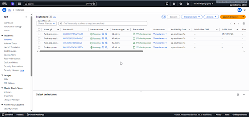
*All 4 EC2 instances running in the AWS Console*

---

## 🔹 Errors & Fixes Summary

| Error | Cause | Fix |
|---|---|---|
| `amazon-linux-extras: command not found` | Amazon Linux 2 no longer available | Use AL2023 and replaced all `yum` with `dnf`; removed `amazon-linux-extras` commands |
| MongoDB `libssl.so.10` errors | MongoDB 6.0 incompatible with AL2023 | Switched to MongoDB 7.0 with AL2023-specific repository |
| `mongod.conf` empty | Failed installation left no config file | Created config file manually using `tee` |
| Private servers cannot download packages | Private subnet has no internet access | Created temporary NAT Gateway; deleted after setup |
| SSH timeout to private servers | Security group SSH rule pointed to home IP, not Proxy Server IP | Changed SSH source to `0.0.0.0/0` temporarily (safe - no public IP on private servers) |
| Ran commands on wrong server | Lost track of which server the terminal was connected to | Learned to always check prompt IP before running commands |
| `scp` failed - `.ssh` directory missing | Proxy Server had no `.ssh` folder yet | Created folder with `mkdir -p ~/.ssh` first, then re-ran `scp` |
| `chmod: cannot access .pem: No such file or directory` | `.pem` file was not successfully copied to proxy | Fixed `.ssh` folder issue and re-ran `scp` successfully |
| Flask environment variables lost | `export` only lasts for current terminal session | Re-exported all variables inside `tmux` session |

---

## 🔹 Key Learnings

**1. VPC is your foundation.**
Every AWS resource in a real application lives inside a VPC. Understanding subnets, route tables, and internet gateways is not optional, it's the foundation of everything else.

**2. Security groups are your per-server firewall.**
The ability to reference one security group from another (instead of using IP addresses) is one of the most powerful security features in AWS. It means your firewall rules stay correct even when server IPs change.

**3. Private subnets have no internet by default, and that's intentional.**
The databases being in a private subnet means no one from the internet can ever reach them directly. This is a fundamental security principle. The NAT Gateway was a temporary workaround for installation only.

**4. Always know which server you are on.**
In a multi-server architecture, it's easy to lose track. I learned to always read the terminal prompt before running commands. `ip-10-0-1-234` is the Proxy Server. `ip-10-0-2-XXX` is a private server.

**5. Real-world AWS adapts over time.**
Amazon Linux 2 was retired. MongoDB 6.0 became incompatible. The instructions I followed were written for a slightly different environment. Knowing WHY each step exists, not just what to type is what allowed me to adapt.

**6. The Bastion Host pattern is standard practice.**
Connecting to private servers through a public "jump" server is not a workaround, it's a deliberate architectural pattern used in real production environments.

---

## 🔹 What's Next

**Lab 3** will replace the manually configured MongoDB and PostgreSQL EC2 servers with AWS managed services:
- **Amazon RDS** - managed PostgreSQL with automated backups and high availability
- **Amazon DocumentDB** - managed MongoDB-compatible database

This removes the burden of manually managing database servers, applying patches, and configuring replication.

---

*Documentation by Jayvee Dela Rosa | Based on the AWS Network Challenge 2 by [Raphael Jambalos](https://dev.to/raphael_jambalos)*

