# Lab 4: Prepare Our Application for Scaling - Remove State from Your Application Servers
 
**Status:** ✅ Complete
 
**Date Completed:** May 4, 2026
 
**Reference:** [AWS Network Challenge 2 by Raphael Jambalos](https://dev.to/raphael_jambalos/aws-network-challenge-2-deploy-a-file-uploading-app-on-ec2-rds-documentdb-16eb)
 
---
 
## 🔹 Overview
 
Lab 4 solves a problem that is invisible until you try to scale. Everything in Labs 1 through 3 worked correctly because there was always exactly one App Server. But the moment a second App Server is added, a hidden flaw in the architecture becomes a real user-facing problem: uploaded images are saved directly to the local disk of whichever server handles the upload request. A second server has its own separate disk. It has never seen those files. Users would get broken images depending on which server handled their request.
 
Lab 4 fixes this by replacing local disk storage with Amazon EFS, a shared network file system that any number of EC2 instances can mount simultaneously. When an image is uploaded, it goes to EFS. Every server sees it immediately. The App Server becomes completely stateless, meaning it holds no data of its own. All data lives in three managed places: RDS for orders, DocumentDB for image metadata, and EFS for image files. This is the architectural prerequisite for the auto-scaling in Lab 5.
 
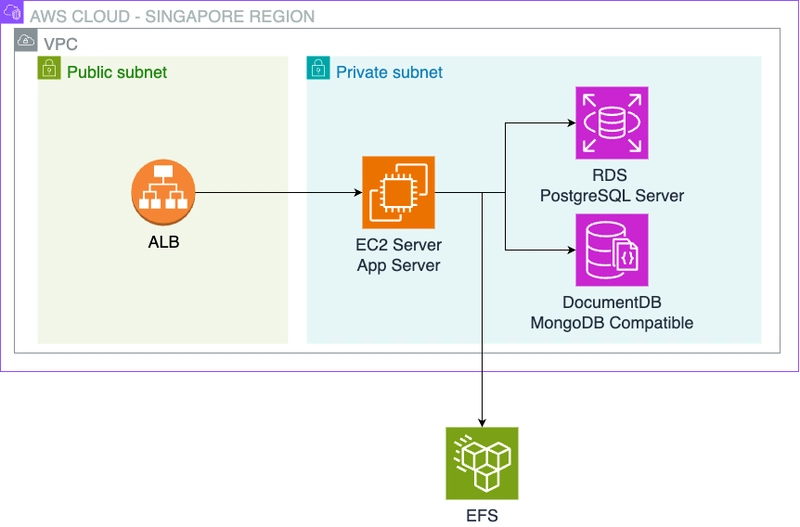
 
*Source: [Raphael Jambalos — AWS Network Challenge 2](https://dev.to/raphael_jambalos/aws-network-challenge-2-deploy-a-file-uploading-app-on-ec2-rds-documentdb-16eb)*
 
---
 
## 🔹 Goal
 
Remove state from the App Server by replacing local disk file storage with Amazon EFS:
 
- Create an EFS file system inside the VPC
- Mount it on the App Server EC2
- Redirect all file uploads from `/tmp` to the shared EFS volume
The Flask application code does not change. Only one environment variable changes.
 
---
 
## 🔹 What I Built
 
**AWS Resources Created:**
 
- 1 new Security Group (`flask-app-efs-sg`)
- 1 Amazon EFS file system (`flask-app-efs`)
- 1 EFS Mount Target in `ap-southeast-1a` (private subnet)
- 1 temporary NAT Gateway (created and deleted during setup)
- 1 temporary Elastic IP (associated with the NAT Gateway, released after deletion)
**Configuration Changes on App Server:**
 
- Installed `amazon-efs-utils` package
- Created mount directory `/home/ec2-user/efs`
- Mounted EFS at `/home/ec2-user/efs`
- Added fstab entry for persistent mount on reboot
- Updated `UPLOAD_DIRECTORY` environment variable
- Started Proxy Server EC2 to use as SSH jump server
---
 
## 🔹 Code Integration
 
The Flask application (`main.py`) was not modified at all. The relevant lines that make this work are already in the code:
 
```python
# Reads UPLOAD_DIRECTORY from environment
UPLOAD_FOLDER = os.getenv("UPLOAD_DIRECTORY")
 
# Sets Flask's upload folder config
app.config['UPLOAD_FOLDER'] = UPLOAD_FOLDER
 
# In the upload route — saves to wherever UPLOAD_FOLDER points
file.save(file_path)
 
# In the download route — reads from wherever UPLOAD_FOLDER points
return send_from_directory(app.config["UPLOAD_FOLDER"], name)
```
 
All four of these lines now operate on EFS instead of `/tmp`. The code did not change. Only the target changed.
 
**Environment variable change:**
 
| Variable | Lab 3 Value | Lab 4 Value |
|---|---|---|
| `UPLOAD_DIRECTORY` | `/tmp` | `/home/ec2-user/efs/uploads` |
| All others | Unchanged | Unchanged |
 
---
 
## 🔹 My Experience
 
### Creating the EFS Security Group
 
The first thing I built was a new security group for EFS. The pattern is the same one from Lab 2 and Lab 3: instead of allowing an IP address, I referenced another security group as the source. `flask-app-efs-sg` allows port 2049 (NFS protocol) only from `flask-app-server-sg`. Only the App Server can ever mount EFS, regardless of what IP it has.
 
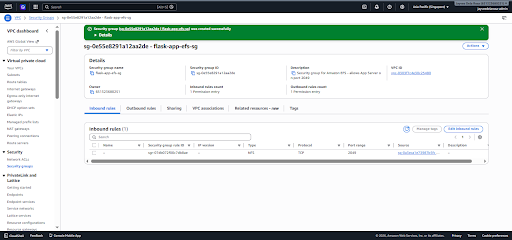
 
*`flask-app-efs-sg` created with NFS inbound rule allowing port 2049 from the App Server security group only*
 
---
 
### Creating the EFS File System
 
I created the EFS file system using the Customize path instead of the quick Create button, because the quick path places EFS in the default VPC. I needed it inside `flask-photo-app-vpc` with the correct security group attached.
 
The key decision during creation was the mount target configuration. AWS tries to create a mount target in every Availability Zone by default. I deleted the `ap-southeast-1b` row and kept only the `ap-southeast-1a` mount target, because the App Server lives in `ap-southeast-1a`. A mount target in `ap-southeast-1b` would never be used and would cost unnecessary money.
 
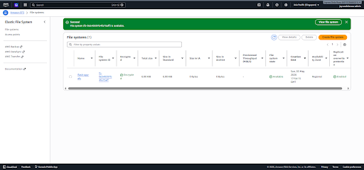
 
*EFS file system showing Available status with the File System ID*
 
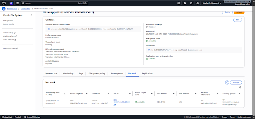
 
*EFS Network tab showing the mount target in `ap-southeast-1a` as Available*
 
---
 
### Installing amazon-efs-utils and the NAT Gateway Problem
 
To mount EFS, the App Server needs a package called `amazon-efs-utils`. I ran the install command from the App Server:
 
```bash
sudo dnf install -y amazon-efs-utils
```
 
The command stalled immediately. The progress bar appeared and stayed frozen for over two minutes without making any progress.
 
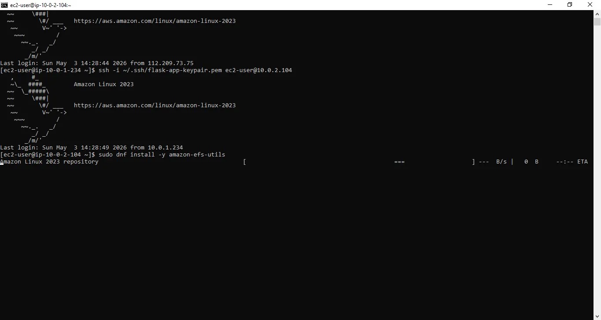
 
*`dnf install` stalled with no progress, indicating no internet access from the private subnet*
 
The cause was the same one from Lab 3: private subnet servers have no outbound internet access by default. The App Server could not reach the package repository. The fix was to create another temporary NAT Gateway, add a route to the private route table, complete the install, and then delete everything immediately afterward.
 
After the NAT Gateway was in place, the install completed cleanly:
 
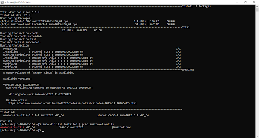
 
*`amazon-efs-utils` installed successfully, with `stunnel` installed as a dependency*
 
---
 
### Mounting EFS and the DNS Resolution Problem
 
With `amazon-efs-utils` installed and the NAT Gateway deleted, I created the mount directory and ran the mount command:
 
```bash
mkdir -p /home/ec2-user/efs
sudo mount -t efs -o tls fs-0e549397b4fa75aff:/ /home/ec2-user/efs
```
 
The command failed with a DNS resolution error. The EFS endpoint hostname could not be resolved, and the error message pointed to the mount target DNS name being unreachable.
 
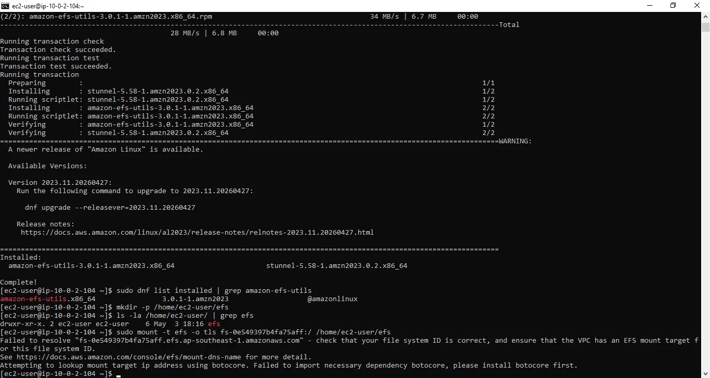
 
*EFS mount failing with a DNS resolution error — the file system endpoint hostname could not be resolved*
 
The cause was a VPC setting. DNS resolution was already enabled on `flask-photo-app-vpc`, but DNS hostnames was not. EFS mounting relies on DNS hostnames to resolve the file system endpoint to the correct mount target IP address. Without DNS hostnames enabled, the EFS DNS name simply does not resolve. The fix was a single checkbox: VPC Console, Edit VPC settings, enable DNS hostnames. After saving that change, the same mount command ran without any output, which is the expected success behavior.
 
Running `df -h` confirmed the mount:
 
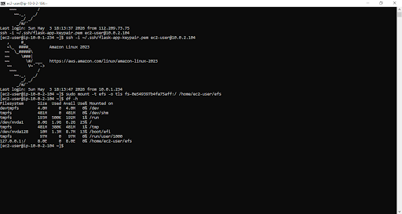
 
*`df -h` showing EFS mounted at `/home/ec2-user/efs` with the expected 8.0E theoretical size*
 
---
 
### Setting Permissions and Making the Mount Permanent
 
When EFS is first mounted, the root of the file system is owned by `root`. The Flask app runs as `ec2-user`. Without a permission change, every upload attempt would fail with a permission denied error. I ran:
 
```bash
sudo chown -R ec2-user:ec2-user /home/ec2-user/efs
```
 
After that, I added the EFS entry to `/etc/fstab` so the mount survives a server reboot:
 
```
fs-0e549397b4fa75aff:/ /home/ec2-user/efs efs _netdev,tls 0 0
```
 
The `_netdev` flag is critical here. It tells the system to wait for the network to be available before attempting to mount EFS on boot. Without it, the mount attempt happens before the network is ready and fails silently, leaving the server saving files to a missing path.
 
Running `sudo mount -fav` confirmed the fstab entry was valid:
 
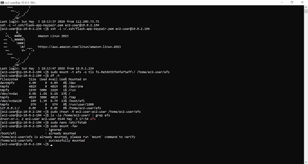
 
*`ls -la` showing the `efs` directory owned by `ec2-user`, and `sudo mount -fav` confirming the fstab entry is valid*
 
---
 
### Updating Flask and Testing the Upload
 
With EFS mounted and permissions correct, I created an uploads subdirectory inside EFS, updated the `UPLOAD_DIRECTORY` environment variable inside the tmux session, and restarted Flask:
 
```bash
mkdir -p /home/ec2-user/efs/uploads
export UPLOAD_DIRECTORY='/home/ec2-user/efs/uploads'
```
 
To test the change, I uploaded my AWS Cloud Practitioner certificate image through the app. The upload form accepted it and returned a success response.
 
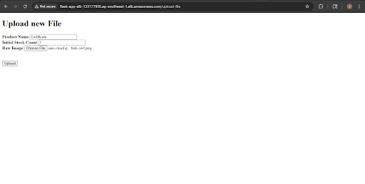
 
*Upload form at `/upload-file` with the AWS Cloud Practitioner certificate image selected*
 
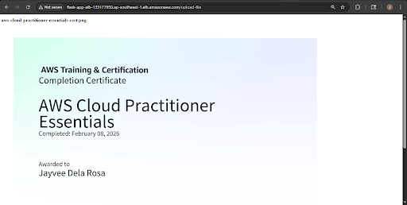
 
*Upload success response confirming the file was accepted and saved*
 
After the upload, I checked the EFS directory from the terminal to confirm the file actually landed on EFS and not on `/tmp`:
 
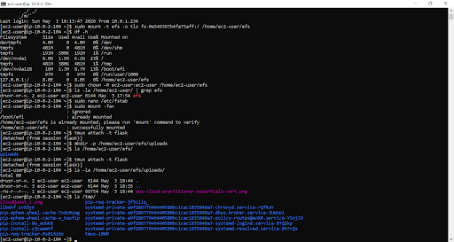
 
*Terminal showing `aws-cloud-practitioner-essentials-cert.png` inside `/home/ec2-user/efs/uploads/`, confirming uploads now go to EFS*
 
Finally, I visited the `/images` page through the ALB DNS to confirm the image loaded correctly from EFS:
 
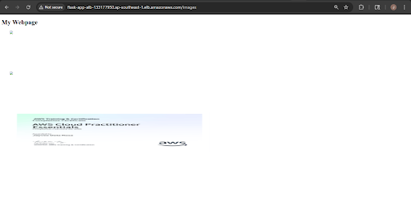
 
*Images page loading the uploaded file correctly via the ALB, with Flask reading from EFS*
 
---
 
## 🔹 Final Verification
 
All verification steps passed after the EFS mount was confirmed and Flask was restarted with the updated environment variable.
 
The uploaded AWS Cloud Practitioner certificate image appeared in the EFS uploads directory, loaded correctly on the `/images` page via the ALB DNS, and nothing new appeared in `/tmp`. The old pre-Lab 4 uploads remain in `/tmp` as expected, since those were saved before `UPLOAD_DIRECTORY` was changed.
 
---
 
## 🔹 Errors and Fixes Summary
 
| Error | Cause | Fix |
|---|---|---|
| `dnf install amazon-efs-utils` stalled indefinitely | Private subnet has no outbound internet access by default | Created a temporary NAT Gateway, added a route to the private route table, completed the install, then deleted the NAT Gateway and route immediately |
| EFS mount failed with DNS resolution error | DNS hostnames was disabled on `flask-photo-app-vpc` | Enabled DNS hostnames in VPC settings via Edit VPC settings in the VPC Console |
 
---
 
## 🔹 Key Learnings
 
**1. Stateless servers are a prerequisite for scaling, not an optional improvement.**
 
The whole point of Lab 4 is not EFS itself. It is the principle behind it. A server that holds data cannot be freely added or removed. If one server has files that another does not, users get inconsistent results depending on which server handles their request. Making the App Server stateless means every instance is identical and interchangeable. The auto-scaling group in Lab 5 can add ten copies of the App Server and every one of them will see every file that was ever uploaded, because none of them store files themselves.
 
**2. DNS hostnames is a separate setting from DNS resolution, and EFS requires both.**
 
I assumed that because DNS resolution was already enabled on the VPC, DNS would work correctly for EFS. It did not. DNS resolution controls whether the VPC can resolve AWS internal DNS at all. DNS hostnames controls whether EC2 instances in the VPC receive DNS hostnames and whether those hostnames resolve correctly for services like EFS. Both must be enabled. Checking only one is not enough.
 
**3. The `_netdev` flag in fstab is not optional for network file systems.**
 
Adding an EFS entry to `/etc/fstab` without `_netdev` creates a boot-time race condition. The system attempts to mount EFS before the network interface is fully initialized, the mount fails silently, and Flask starts pointing at a directory that does not exist. The `_netdev` flag is a single word that tells the init system to defer the mount until the network is ready. It is easy to forget and hard to debug after the fact.
 
**4. Private subnets will continue to require temporary NAT Gateways for any package installation.**
 
This came up in Lab 3 for the pymongo downgrade and again in Lab 4 for `amazon-efs-utils`. The pattern is now familiar: create the NAT Gateway, add the route, do the work, delete everything immediately. What matters is not treating the NAT Gateway as permanent. Each time it was created in this project, it was deleted within minutes of finishing the install. The cost of leaving one running accidentally is not trivial.
 
**5. A change in one environment variable can completely redirect where an application stores its data.**
 
The entire Lab 4 infrastructure change, the security group, the EFS file system, the mount target, the fstab entry, all of it exists to support a single environment variable change from `/tmp` to `/home/ec2-user/efs/uploads`. The Flask app has no idea where it is saving files. It reads `UPLOAD_DIRECTORY` and writes there. This is why environment-variable-driven configuration is not just a convenience. It is what allows the infrastructure to evolve without touching application code.
 
---
 
## 🔹 Cleanup Performed
 
| Action | Reason |
|---|---|
| Deleted temporary NAT Gateway | Created only to allow `amazon-efs-utils` installation on the private App Server. Deleted immediately after to stop charges |
| Released temporary Elastic IP | Associated with the temporary NAT Gateway. Released after NAT Gateway reached Deleted status |
| Removed `0.0.0.0/0` route from private route table | Added temporarily to route traffic through the NAT Gateway. Removed after installation was complete to restore private subnet isolation |
 
---
 
## 🔹 What's Next
 
**Lab 5** is where everything built in Labs 3 and 4 pays off. The App Server is now completely stateless. RDS holds orders. DocumentDB holds image metadata. EFS holds image files. The server itself holds nothing. This means it can be cloned and scaled automatically.
 
Lab 5 introduces Amazon Auto Scaling Groups. An AMI is created from the current App Server, and that image is used to launch identical copies automatically when CPU utilization exceeds a threshold. When demand drops, the extra instances are terminated. The ALB already in place from Lab 3 distributes traffic across however many instances are running at any given time. All of this happens without any manual intervention.
 
---
 
*Documentation by Jayvee Dela Rosa | Based on the AWS Network Challenge 2 by [Raphael Jambalos](https://dev.to/raphael_jambalos/aws-network-challenge-2-deploy-a-file-uploading-app-on-ec2-rds-documentdb-16eb)*

