# Lab 6: CI/CD Pipeline with AWS CodePipeline and CodeDeploy

**Status:** ✅ Complete

**Date Completed:** May 11, 2026

**Reference:** [AWS Network Challenge 2 by Raphael Jambalos](https://dev.to/raphael_jambalos/aws-network-challenge-2-deploy-a-file-uploading-app-on-ec2-rds-documentdb-16eb)

---

## ⚡ TL;DR

- Built a full CI/CD pipeline using AWS CodePipeline and CodeDeploy targeting the Lab 5 ASG, with `appspec.yml`, `stop_flask.sh`, and `start_server.sh` committed to a forked GitHub repository
- Hit the NAT Gateway problem first: the CodeDeploy agent could not reach `codedeploy-commands.ap-southeast-1.amazonaws.com:443` because the private subnet had no outbound internet route after Lab 5 cleanup, confirmed via `ip route show` on the instance, fixed by recreating the NAT Gateway
- Discovered that moving a Python venv breaks its internal shebang paths, causing `nohup: failed to run command '/home/ec2-user/venv/bin/flask': No such file or directory` on every deployment, fixed by launching from the original Lab 5 AMI, recreating the venv correctly at `/home/ec2-user/venv`, and baking it into AMI v4
- Fixed a secondary Flask startup failure where `nohup flask` could not resolve the command without the full absolute path, fixed by changing the `start_server.sh` script to use `/home/ec2-user/venv/bin/flask` directly
- Pipeline ran end-to-end successfully: pushed a code change from the laptop, the pipeline triggered automatically from the GitHub push, CodeDeploy deployed to the ASG instance, and the browser confirmed the new message live via the ALB
- Had a previous failed attempt in May 5-8 that was stopped due to Finals week pressure and AWS costs reaching $93, fully cleaned up, and restarted cleanly on May 11

---

## 🔹 Overview

Every lab up to this point built toward one goal: remove manual work from the infrastructure. Lab 3 removed the need to manage databases manually. Lab 4 removed local file storage. Lab 5 removed the need to manually scale servers. Lab 6 removes the last remaining manual step: deploying code.

Before Lab 6, updating the Flask app meant SSHing into every running server, pulling the latest code, and restarting Flask. If the ASG had three instances running, that process had to be repeated three times. Any new instance launched after a manual update would still have the old code because it came from an old AMI. Lab 6 replaces all of that with two AWS services working together. AWS CodePipeline watches the GitHub repository and triggers automatically on every push. AWS CodeDeploy takes that code and deploys it to every instance in the ASG without any manual intervention.

This lab took two attempts. The first attempt ran from May 5 to May 8 and was stopped before completion due to Finals week and mounting AWS costs. Everything was cleaned up and the infrastructure was restored to its Lab 5 state. The second attempt on May 11 started from a clean baseline, worked through every problem methodically, and reached full end-to-end verification: a code change pushed from the laptop appeared live in the browser without touching a single server.


*Source: [Raphael Jambalos — AWS Network Challenge 2](https://dev.to/raphael_jambalos/aws-network-challenge-2-deploy-a-file-uploading-app-on-ec2-rds-documentdb-16eb)*

---

## 🔹 Goal

Build a fully automated CI/CD pipeline that deploys code changes to the ASG without any manual intervention:

- Set up a GitHub repository with CodeDeploy configuration files
- Create IAM roles for CodeDeploy and EC2 to communicate with each other
- Install the CodeDeploy agent on the ASG instance and bake it into a new AMI
- Create a CodeDeploy Application and Deployment Group targeting the ASG
- Create a CodePipeline connected to GitHub that triggers on every push
- Verify the pipeline by pushing a visible code change and watching it deploy automatically

---

## 🔹 What I Built

**AWS Resources Created:**

- 1 GitHub repository (`jayveedelarosa/file-upload-flask`) forked from Sir Raphael's original
- 2 deployment scripts (`scripts/stop_flask.sh` and `scripts/start_server.sh`) committed to the repository
- 1 `appspec.yml` file defining the CodeDeploy deployment instructions
- 1 IAM Role (`CodeDeployServiceRole`) for CodeDeploy to interact with EC2 and S3
- 1 IAM Role (`EC2CodeDeployInstanceProfile`) for EC2 instances to pull deployment bundles from S3
- 4 AMI versions across both attempts, each capturing a progressively cleaner server state
- Multiple Launch Template versions updated to use each new AMI
- 1 CodeDeploy Application (`flask-photo-app`)
- 1 CodeDeploy Deployment Group (`flask-app-deployment-group`) targeting `flask-app-asg`
- 1 CodePipeline (`flask-cicd-pipeline`) connected to GitHub via GitHub App connection
- 1 NAT Gateway providing outbound internet access for the CodeDeploy agent in the private subnet

---

## 🔹 Code Integration

Three files were added to the repository to tell CodeDeploy what to do before, during, and after it copies new code onto the server.

`appspec.yml` is the instruction manual. It maps the source files to their destination on the server, sets the correct file ownership, and defines which scripts to run at each lifecycle event:

```yaml
version: 0.0
os: linux
files:
  - source: /
    destination: /home/ec2-user/file-upload-flask
    overwrite: true
permissions:
  - object: /home/ec2-user/file-upload-flask
    owner: ec2-user
    group: ec2-user
    type:
      - directory
      - file
hooks:
  ApplicationStop:
    - location: scripts/stop_flask.sh
      timeout: 30
      runas: ec2-user
  ApplicationStart:
    - location: scripts/start_server.sh
      timeout: 60
      runas: ec2-user
```

`scripts/stop_flask.sh` stops Flask and clears the application directory before CodeDeploy copies new files:

```bash
#!/bin/bash
pkill -f "flask --app main" || true
pkill -f "start-flask.sh" || true
rm -rf /home/ec2-user/file-upload-flask
echo "Flask stopped"
```

The `|| true` on each `pkill` line prevents CodeDeploy from treating a missing process as a failure. The `rm -rf` line guarantees a clean slate before every deployment, which was a critical fix discovered during troubleshooting.

`scripts/start_server.sh` activates the environment and starts Flask after the new code is in place:

```bash
#!/bin/bash
source /home/ec2-user/flask-env.sh
cd /home/ec2-user/file-upload-flask
source /home/ec2-user/venv/bin/activate
pip install -r requirements.txt
mkdir -p /home/ec2-user/efs/uploads
nohup /home/ec2-user/venv/bin/flask --app main run --host 0.0.0.0 >> /home/ec2-user/flask.log 2>&1 &
echo "Flask started with PID $!"
```

Two things in this script are worth noting. The venv path uses the full absolute path `/home/ec2-user/venv` rather than a relative path, because the venv lives outside the `file-upload-flask` directory that CodeDeploy manages. The `flask` command also uses a full absolute path `/home/ec2-user/venv/bin/flask` rather than just `flask`, because `nohup` does not inherit the activated venv PATH and cannot resolve the command otherwise. Both of these were lessons learned the hard way during troubleshooting.

`nohup` is what keeps Flask alive after the script exits. CodeDeploy runs scripts in a temporary shell that closes when the script finishes. Without `nohup`, Flask would be killed the moment the start script exits.

---

## 🔹 My Experience

### Starting From a Clean Baseline

Before building anything, I confirmed the infrastructure was back in its Lab 5 state. The ASG was running one healthy instance, the target group showed it as healthy, and the ALB was serving traffic correctly. Starting from a verified clean state was the right call after the first attempt left behind several AMI versions and a cluttered Launch Template history.

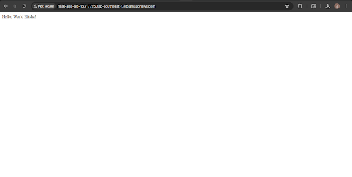

*ASG running one healthy instance and ALB serving traffic correctly before any Lab 6 resources were created*

---

### Setting Up the Repository and CodeDeploy Files

The first task was getting the GitHub repository ready. I forked Sir Raphael's original repository, cloned it locally on Windows, and added the three CodeDeploy configuration files: `appspec.yml`, `scripts/stop_flask.sh`, and `scripts/start_server.sh`. One small issue here was that `appspec.yml` was saved empty on the first push because I forgot to save the file in VS Code before committing. Catching that early on the GitHub file view saved a lot of confusion later.

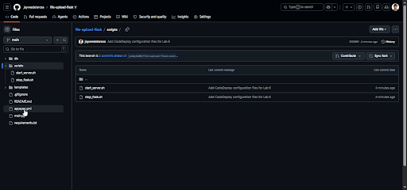

*GitHub repository showing `appspec.yml` at the root and the `scripts/` folder after the corrected push*

---

### Creating the IAM Roles

CodeDeploy needs two separate IAM roles. The first, `CodeDeployServiceRole`, gives the CodeDeploy service itself permission to interact with EC2 instances, read from S3, and communicate with the ASG. The second, `EC2CodeDeployInstanceProfile`, gives the EC2 instances permission to download deployment bundles from S3 and receive instructions from CodeDeploy.

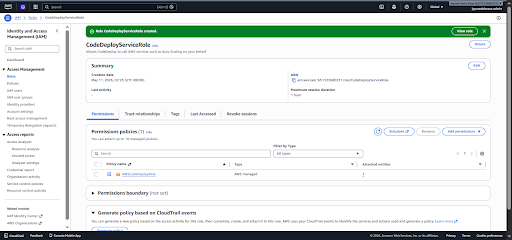

*`CodeDeployServiceRole` created in IAM with the `AWSCodeDeployRole` policy attached*

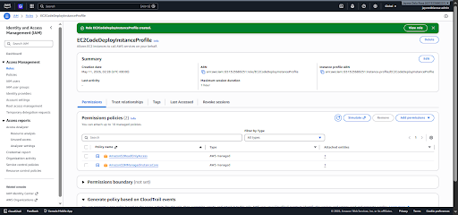

*`EC2CodeDeployInstanceProfile` created with `AmazonS3ReadOnlyAccess` and `AmazonSSMManagedInstanceCore` policies*

---

### Installing the CodeDeploy Agent and Building a Clean AMI

The CodeDeploy agent is a small process that runs on each EC2 instance and listens for deployment instructions from the service. Without it, CodeDeploy has no way to reach the instance.

I SSHed into the running ASG instance through the proxy server and installed the agent. After confirming it was active and running, I needed to decide what AMI to build from. This is where the first attempt taught an important lesson. In that attempt, the venv was inside `file-upload-flask`, which was later deleted from the AMI to give CodeDeploy a clean deployment target. The problem was that the venv was moved using `mv` rather than rebuilt, and moving a Python venv breaks the internal shebang lines. Every script inside the venv still pointed to the old path `/home/ec2-user/file-upload-flask/venv/bin/python3`, which no longer existed. Flask would fail to start on every deployment with:

```bash 
nohup: failed to run command '/home/ec2-user/venv/bin/flask': No such file or directory 
```

And even before that, running the flask executable directly would return:

```bash
-bash: /home/ec2-user/venv/bin/flask: cannot execute: required file not found
```

Checking the shebang confirmed everything:

```bash
head -1 /home/ec2-user/venv/bin/flask
#!/home/ec2-user/file-upload-flask/venv/bin/python3
```

The Python interpreter it expected was gone. The fix was not to move the venv. It was to rebuild it from scratch at the correct location. I launched a fresh standalone instance from the original Lab 5 AMI where `file-upload-flask` still existed, deleted the old broken venv, and created a new one at `/home/ec2-user/venv`:

```bash
rm -rf /home/ec2-user/venv
python3 -m venv /home/ec2-user/venv
source /home/ec2-user/venv/bin/activate
pip install -r /home/ec2-user/file-upload-flask/requirements.txt
deactivate
```

This time the shebang pointed correctly to `/home/ec2-user/venv/bin/python3`. I then installed the CodeDeploy agent on this instance, updated `start-flask.sh` to handle the case where `file-upload-flask` does not yet exist on first boot, removed the `file-upload-flask` directory so CodeDeploy would have a clean target, and took AMI v4 from that clean state.

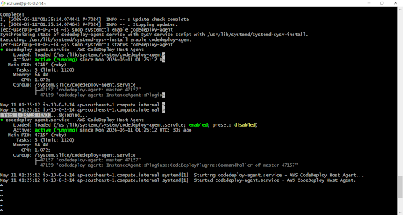

*Terminal showing the CodeDeploy agent with `active (running)` status after installation*

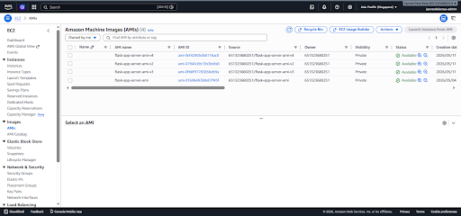

*AMI showing Available status after the CodeDeploy agent was installed and the venv was correctly rebuilt*

After the AMI was available, I updated the Launch Template with the new AMI and attached the `EC2CodeDeployInstanceProfile`. The ASG was updated to use the new Launch Template version and the old temporary instance was terminated.

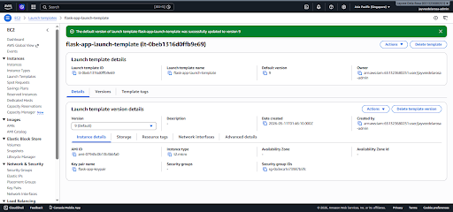

*Launch Template updated with the new AMI and IAM instance profile, set as the default version*

---

### Setting Up CodeDeploy

With the IAM roles and the clean AMI in place, I created the CodeDeploy Application and Deployment Group. The deployment group targeted `flask-app-asg` directly and was configured for In-place deployments using `CodeDeployDefault.AllAtOnce`. The load balancer integration was enabled, pointing to `flask-app-target-group`, so CodeDeploy would block and restore ALB traffic correctly around each deployment.

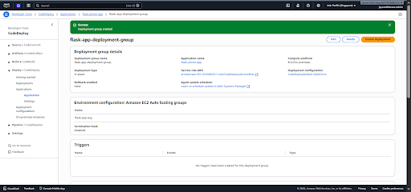

*`flask-app-deployment-group` created targeting `flask-app-asg` with `CodeDeployDefault.AllAtOnce` and ALB integration*

---

### The NAT Gateway Problem

Before creating the pipeline, the NAT Gateway needed to come back. This was the central problem that ended the first attempt. The CodeDeploy agent continuously polls `codedeploy-commands.ap-southeast-1.amazonaws.com:443`. That is a public endpoint. After Lab 5 cleanup, the NAT Gateway was deleted, leaving the private subnet with no outbound internet route. Without it, the agent times out trying to connect and every pipeline run fails at `BeforeBlockTraffic` with a network error.

I recreated the NAT Gateway in the public subnet, allocated a new Elastic IP, and added the `0.0.0.0/0` route back to the private route table. After confirming the agent could reach the CodeDeploy endpoint, I restarted the agent to clear any backoff state from its earlier failed attempts.

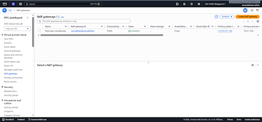

*NAT Gateway showing Available status with the private route table updated to route outbound traffic through it*

---

### Creating the CodePipeline

The pipeline setup used GitHub App connection rather than the older OAuth method, which provides more fine-grained repository access. One unexpected issue appeared during pipeline creation: AWS threw a duplicate policy error claiming `AWSCodePipelineServiceRole-ap-southeast-1-flask-app-pipeline` already existed. Searching for it in IAM under both Roles and Policies returned nothing. This was a ghost state left over from a partial pipeline creation in the first attempt. The fix was straightforward: use a custom service role name instead of letting AWS auto-generate one, which bypassed the conflict entirely.

The pipeline was configured with GitHub as the source stage pointing to the `main` branch, no build stage since Python needs no compilation, and AWS CodeDeploy as the deploy stage pointing to `flask-photo-app` and `flask-app-deployment-group`.

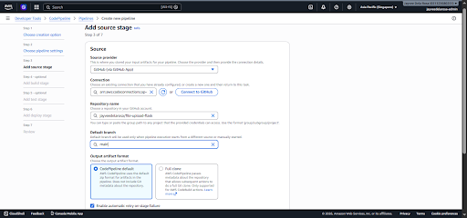

*CodePipeline source stage configured with GitHub via GitHub App connection, pointing to the `main` branch*

---

### The First Pipeline Run

The pipeline ran immediately after creation. The Source stage passed. The Deploy stage started and the lifecycle events began ticking through.


*First pipeline execution running after the pipeline was created*

All lifecycle events passed. `BeforeBlockTraffic`, `BlockTraffic`, `AfterBlockTraffic`, `ApplicationStop`, `DownloadBundle`, `BeforeInstall`, `Install`, `AfterInstall`, `ApplicationStart`, `ValidateService`, `BeforeAllowTraffic` all turned green. The pipeline completed successfully.


*CodeDeploy deployment showing all lifecycle events succeeded*


*CodePipeline showing both Source and Deploy stages green after the first successful deployment*

---

### Flask Not Starting After Deployment

Despite all lifecycle events passing, `curl http://localhost:5000/` on the instance still returned connection refused. The `file-upload-flask` directory had been deployed correctly, but Flask was not running. Checking `flask.log` showed the problem:

```bash
nohup: failed to run command '/home/ec2-user/venv/bin/flask': No such file or directory 
```

This was confusing because the venv had been rebuilt correctly and the flask executable was confirmed present at that path. Running it directly revealed the real issue:

```bash
/home/ec2-user/venv/bin/flask --version
-bash: /home/ec2-user/venv/bin/flask: cannot execute: required file not found
```

The file existed but could not execute. The shebang at the top of the flask executable still pointed to the old broken path from a previous AMI iteration. This particular instance had been running before the AMI v4 rebuild and had inherited the broken venv.

The permanent fix was to update `start_server.sh` in the GitHub repository to call flask using its full absolute path:

```bash
nohup /home/ec2-user/venv/bin/flask --app main run --host 0.0.0.0 >> /home/ec2-user/flask.log 2>&1 &
```

This change was committed and pushed. The pipeline triggered automatically from the push, deployed the updated script, and Flask started correctly on the next deployment.


*App returning the expected response via the ALB DNS after the pipeline deployed successfully and Flask started*

---

### The Full CI/CD Test

With Flask confirmed running and the ALB showing the instance as healthy, the final test was the whole point of Lab 6. I opened `main.py` in VS Code, found the root route, and changed the return message:

```python
return "<p>Hello from Jayvee Dela Rosa - AWS Network Challenge 2 Lab 6 CI/CD!</p>"
```

Then from the VS Code terminal:

```bash
git add main.py
git commit -m "Lab 6 final test: CI/CD pipeline verification"
git push origin main
```

Within 60 seconds of the push, the pipeline started a new execution.


*New pipeline execution starting within seconds of the GitHub push*

Both stages turned green. I opened the browser and visited the ALB DNS name.

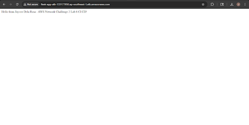

*Browser showing "Hello from Jayvee Dela Rosa - AWS Network Challenge 2 Lab 6 CI/CD!" served through the ALB*

The message was live. No SSH. No manual restart. No touching the server. One push and the pipeline handled everything.

I also confirmed the upload and images routes were still working correctly after the deployment, to make sure the CI/CD flow had not broken anything that was already working.

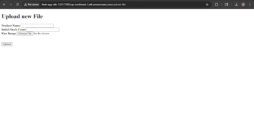

*Upload form accessible and functional through the ALB after the deployment*

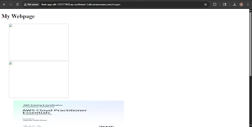

*Images page loading correctly through the ALB after the deployment*

---

## 🔹 Final Verification

All verification steps passed. The pipeline triggered from a GitHub push, CodeDeploy deployed the updated code to the ASG instance, Flask restarted correctly using the newly deployed script, and the browser confirmed the updated message was live via the ALB. The upload and images routes continued working throughout the deployment cycle without any interruption.

---

## 🔹 Errors and Fixes Summary

| Error | Cause | Fix |
|---|---|---|
| `appspec.yml` pushed empty to GitHub | File was not saved in VS Code before running `git add` | Caught early by viewing the file on GitHub, saved and re-pushed correctly |
| `BeforeBlockTraffic` fails with network error on every pipeline run | CodeDeploy agent cannot reach `codedeploy-commands.ap-southeast-1.amazonaws.com:443` because the private subnet has no outbound internet route after Lab 5 NAT Gateway deletion | Recreated the NAT Gateway and added `0.0.0.0/0` route back to the private route table |
| Duplicate IAM policy error when creating CodePipeline | Ghost state from a partial pipeline creation in the first attempt left a policy name reserved in AWS even though it was invisible in IAM | Used a custom service role name instead of the auto-generated one, bypassing the conflict |
| `nohup: failed to run command '/home/ec2-user/venv/bin/flask': No such file or directory` | The venv was moved using `mv` instead of rebuilt, breaking all internal shebang paths inside the venv scripts to point to the old location | Launched from the original Lab 5 AMI, deleted the broken venv, rebuilt it at `/home/ec2-user/venv` using `python3 -m venv`, installed all dependencies, and took a fresh AMI from that clean state |
| Flask not starting after deployment even with correct venv | The running instance predated the venv rebuild and still had the broken shebang, causing `nohup flask` to fail even after all CodeDeploy lifecycle events passed | Updated `start_server.sh` in the repository to call flask via its full absolute path `/home/ec2-user/venv/bin/flask`, pushed the fix, and the pipeline redeployed it automatically |
| ASG instances looping through terminating and relaunching | `start-flask.sh` on new instances exited with an error when `file-upload-flask` did not exist yet before the first CodeDeploy deployment | Added a directory check to `start-flask.sh` so it exits cleanly when `file-upload-flask` is absent, allowing the instance to survive the health check grace period until CodeDeploy deploys |

---

## 🔹 Key Learnings

**1. Moving a Python venv breaks it. Always rebuild it.**

A Python virtual environment contains executable scripts with hardcoded shebang lines pointing to the Python interpreter that was used to create it at its original path. When you move the venv directory using `mv`, the shebangs still point to the old path. Every script inside the venv, including the `flask` command, becomes unable to execute. The only correct approach is to create a fresh venv at the intended permanent location, then install dependencies into it there. This is a non-obvious failure that produces a cryptic error message and is easy to miss if you do not know to look at the shebang line first.

**2. `nohup` does not inherit a shell's activated environment.**

Activating a venv with `source venv/bin/activate` sets up your current shell session. But `nohup` spawns a new process that does not inherit that environment. Writing `nohup flask` after activating the venv works in an interactive terminal but fails silently when run from a CodeDeploy lifecycle script. The reliable solution is to use the full absolute path to the executable: `/home/ec2-user/venv/bin/flask`. This works regardless of whether any venv is activated and regardless of the calling context.

**3. The AMI is the source of truth for every new instance. Bad state in the AMI compounds forever.**

Every problem in Lab 6 that took more than one attempt to fix came down to AMI state. A broken venv baked into the AMI means every new instance launched by the ASG inherits that broken venv. A missing CodeDeploy agent in the AMI means every new instance has no way to receive deployments. The AMI determines what every new instance starts with, and the ASG can launch new instances at any time. Getting the AMI right is not a one-time task. It is the central discipline of any ASG-based architecture.

**4. Private subnets need an explicit outbound path for every AWS service they talk to.**

The CodeDeploy agent polls a public endpoint on port 443. An instance in a private subnet has no path to that endpoint without a NAT Gateway or a properly configured VPC Interface Endpoint. This is not specific to CodeDeploy. Any AWS service that an instance needs to call from a private subnet requires deliberate network planning. Deleting the NAT Gateway after Lab 5 to save costs was the right call at the time, but it meant Lab 6 had to start by restoring outbound connectivity before any pipeline work could happen.

**5. CI/CD infrastructure has its own bootstrap problem.**

You need the CodeDeploy agent installed and running before CodeDeploy can deploy anything. The agent needs to be baked into the AMI before the ASG can launch instances that are ready to receive deployments. The AMI needs to be in the Launch Template before the ASG uses it. The pipeline cannot deploy until the agent is reachable. Every step in the chain depends on the previous one, and a failure at any step resets the entire cycle. Completing the bootstrap correctly in the right order was more than half the work of this lab.

**6. A push to GitHub should feel boring when CI/CD is working correctly.**

The moment that confirmed Lab 6 was truly complete was not the green checkmark on the pipeline. It was visiting the ALB URL in the browser and seeing the new message without having done anything on the server. No SSH session. No `git pull`. No Flask restart. Just a commit, a push, and a URL refresh. That combination, code change to live deployment with no manual steps, is what all six labs were building toward. When it is working correctly, it should feel almost too easy.

---

## 🔹 Cleanup Performed

| Action | Reason |
|---|---|
| Deleted NAT Gateway, removed route from private route table, released Elastic IP | NAT Gateway charges per hour. Removed immediately after pipeline verification to stop costs accumulating |
| Stopped DocumentDB cluster | Reduces hourly charges while not actively developing |
| Stopped proxy server instance | No active SSH sessions needed after lab completion |

---

## 🔹 What's Next

Lab 6 completes the challenge Sir Raphael set on April 21. The infrastructure now covers everything from a single LightSail server in Lab 1 to a fully automated, auto-scaling, CI/CD-enabled deployment in Lab 6. A code change pushed from a laptop deploys itself to every running instance in the ASG without any manual intervention. That is the foundation the challenge was asking for.

---

*Documentation by Jayvee Dela Rosa | Based on the AWS Network Challenge 2 by [Raphael Jambalos](https://dev.to/raphael_jambalos/aws-network-challenge-2-deploy-a-file-uploading-app-on-ec2-rds-documentdb-16eb)*


