# Lab 6: CI/CD Pipeline with AWS CodePipeline and CodeDeploy

**Status:** ⚠️ Attempted

**Date:** May 5-8, 2026

**Reference:** [AWS Network Challenge 2 by Raphael Jambalos](https://dev.to/raphael_jambalos/aws-network-challenge-2-deploy-a-file-uploading-app-on-ec2-rds-documentdb-16eb)

---

## 🔹 Overview

Every lab up to this point built toward one goal: remove manual work from the infrastructure. Lab 3 removed the need to manage databases manually. Lab 4 removed local file storage. Lab 5 removed the need to manually scale servers. Lab 6 was supposed to remove the last remaining manual step: deploying code.

Before Lab 6, updating the Flask app meant SSHing into every running server, pulling the latest code, and restarting Flask. If the ASG had three instances running, that process had to be repeated three times. Any new instance launched after a manual update would still have the old code because it came from an old AMI. Lab 6 was designed to replace all of that with two AWS services working together. AWS CodePipeline would watch the GitHub repository and trigger automatically on every push. AWS CodeDeploy would take that code and deploy it to every instance in the ASG without any manual intervention.

The lab did not fully complete. The pipeline ran successfully at least once, and the deployment lifecycle events all turned green. But a combination of infrastructure constraints, repeated AMI cycles, and the realities of a tight deadline made it impossible to reach the final verification step. With Finals week approaching, AWS costs accumulating daily, and May 9 as a hard deadline, I made the decision to stop, clean up all Lab 6 resources, and restore the infrastructure back to its Lab 5 state.

This document covers what was built, what broke and what I learned

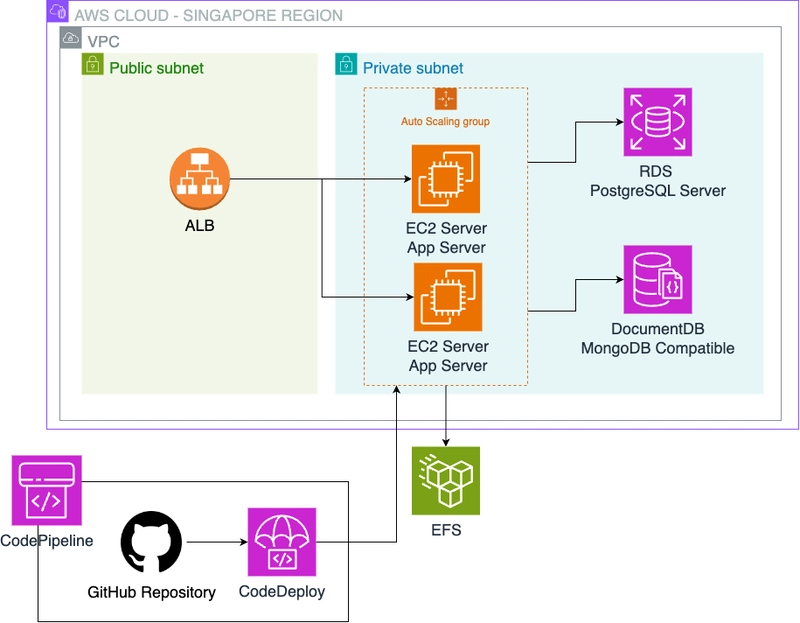

*Source: [Raphael Jambalos — AWS Network Challenge 2](https://dev.to/raphael_jambalos/aws-network-challenge-2-deploy-a-file-uploading-app-on-ec2-rds-documentdb-16eb)*

---

## 🔹 Goal

Build a fully automated CI/CD pipeline that deploys code changes to the ASG without any manual intervention:

- Set up a GitHub repository with CodeDeploy configuration files
- Install the CodeDeploy agent on the ASG instance and bake it into a new AMI
- Create IAM roles for CodeDeploy and EC2 to communicate with each other
- Create a CodeDeploy Application and Deployment Group targeting the ASG
- Create a CodePipeline connected to GitHub that triggers on every push
- Verify the pipeline by pushing a visible code change and watching it deploy automatically

---

## 🔹 What I Built

**AWS Resources Created:**

- 1 GitHub repository (`jayveedelarosa/file-upload-flask`) forked from Sir Raphael's original
- 2 deployment scripts (`scripts/stop_flask.sh` and `scripts/start_server.sh`) committed to the repository
- 1 `appspec.yml` file defining the CodeDeploy deployment instructions
- 1 IAM Role (`CodeDeployServiceRole`) for CodeDeploy to interact with EC2 and S3
- 1 IAM Role (`EC2CodeDeployInstanceProfile`) for EC2 instances to pull deployment bundles from S3
- Multiple AMI versions capturing the CodeDeploy agent installation at different stages
- Multiple Launch Template versions updated to use each new AMI
- 1 CodeDeploy Application (`flask-photo-app`)
- 1 CodeDeploy Deployment Group (`flask-app-deployment-group`) targeting `flask-app-asg`
- 1 CodePipeline (`flask-app-pipeline`) connected to GitHub via GitHub App connection
- 1 NAT Gateway (created and deleted multiple times to provide temporary internet access)

**Note on cleanup:** All Lab 6 resources listed above were fully deleted at the end of this lab. The infrastructure was restored to its Lab 5 state with the original AMI, Launch Template Version 1, and the ASG running cleanly.

---

## 🔹 Code Integration

Three files were added to the repository for CodeDeploy to work. These files tell CodeDeploy what to do before, during, and after it copies new code onto the server.

`appspec.yml` is the instruction manual. It maps the source files to their destination on the server, sets the correct file ownership, and defines which scripts to run at each lifecycle event:

```yaml
version: 0.0
os: linux
files:
  - source: /
    destination: /home/ec2-user/file-upload-flask
    overwrite: true
permissions:
  - object: /home/ec2-user/file-upload-flask
    owner: ec2-user
    group: ec2-user
    type:
      - directory
      - file
hooks:
  ApplicationStop:
    - location: scripts/stop_flask.sh
      timeout: 30
      runas: ec2-user
  ApplicationStart:
    - location: scripts/start_server.sh
      timeout: 60
      runas: ec2-user
```

`scripts/stop_flask.sh` stops Flask gracefully before CodeDeploy copies new files:

```bash
#!/bin/bash
pkill -f "flask --app main" || true
pkill -f "start-flask.sh" || true
rm -rf /home/ec2-user/file-upload-flask
echo "Flask stopped"
```

The `|| true` on each `pkill` line prevents CodeDeploy from treating a missing process as a failure. The `rm -rf` line was added later in the troubleshooting process to resolve a file conflict issue described in the My Experience section.

`scripts/start_server.sh` activates the environment and starts Flask after the new code is in place:

```bash
#!/bin/bash
source /home/ec2-user/flask-env.sh
cd /home/ec2-user/file-upload-flask
source venv/bin/activate
pip install -r requirements.txt
mkdir -p /home/ec2-user/efs/uploads
nohup flask --app main run --host 0.0.0.0 >> /home/ec2-user/flask.log 2>&1 &
echo "Flask started with PID $!"
```

`nohup` is what keeps Flask alive after the script exits. CodeDeploy runs scripts in a temporary shell that closes when the script finishes. Without `nohup`, Flask would be killed the moment the start script exits.

---

## 🔹 My Experience

### Setting Up the Repository and CodeDeploy Files

The first section of Lab 6 was the most straightforward. I forked Sir Raphael's repository, cloned it locally, and added the three CodeDeploy configuration files: `appspec.yml`, `scripts/stop_flask.sh`, and `scripts/start_server.sh`. Committing and pushing them to GitHub confirmed the structure was correct.

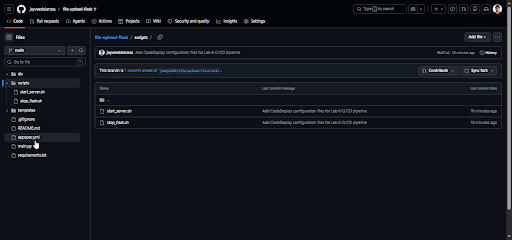

*GitHub repository showing `appspec.yml` and the `scripts/` folder after the initial push*

Installing Git on Windows was required first since it was not installed on my machine. Once installed, the clone, commit, and push all worked without issues.

---

### Installing the CodeDeploy Agent

The CodeDeploy agent is a small process that runs on each EC2 instance and listens for deployment instructions. Without it, CodeDeploy has no way to reach the instance. I SSHed into the current ASG instance through the proxy server and ran the installation commands.

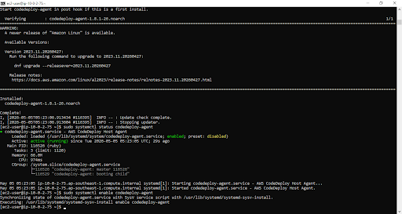

*Terminal showing the CodeDeploy agent with `active (running)` status after installation*

After confirming the agent was running, I created a new AMI from the instance to bake the agent in permanently.

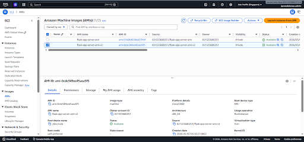

*New AMI showing Available status after the CodeDeploy agent was installed*

I then updated the Launch Template with the new AMI and the `EC2CodeDeployInstanceProfile` IAM role, and updated the ASG to use the new Launch Template version.

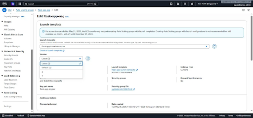

*Auto Scaling Group updated to use the new Launch Template version with the CodeDeploy agent baked in*

---

### Creating the IAM Roles

CodeDeploy needs two IAM roles to operate. The first gives CodeDeploy itself permission to interact with EC2 instances and read from S3. The second gives the EC2 instances permission to pull deployment bundles from S3 and communicate with CodeDeploy.

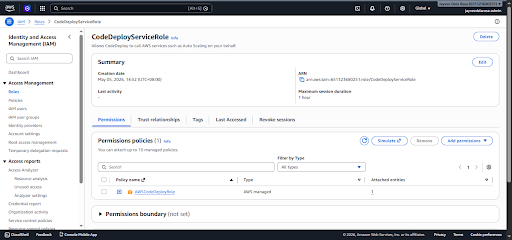

*`CodeDeployServiceRole` created in IAM with the `AWSCodeDeployRole` policy attached*

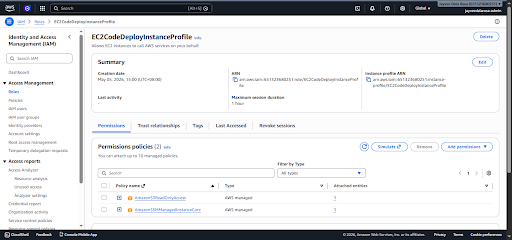

*`EC2CodeDeployInstanceProfile` created with `AmazonS3ReadOnlyAccess` and `AmazonSSMManagedInstanceCore` policies*

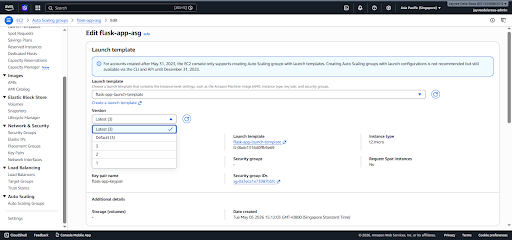

*Launch Template updated to include the `EC2CodeDeployInstanceProfile` so every new ASG instance gets the role automatically*

---

### Setting Up CodeDeploy and CodePipeline

With the IAM roles in place, I created the CodeDeploy Application and Deployment Group, then built the CodePipeline.

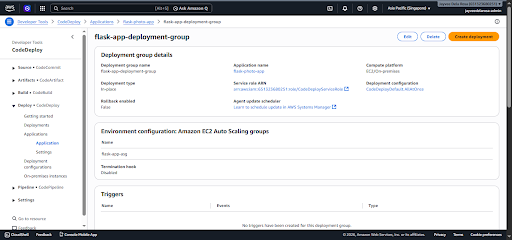

*`flask-app-deployment-group` created targeting `flask-app-asg` with `CodeDeployDefault.AllAtOnce`*

The CodePipeline setup used the new GitHub App connection method instead of the older OAuth method. 

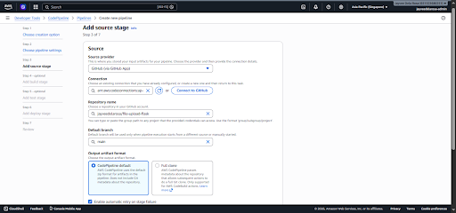

*CodePipeline source stage configured with GitHub via GitHub App connection, pointing to the `main` branch*

---

### The First Pipeline Run and the NAT Gateway Problem

The pipeline ran for the first time immediately after creation. The Source stage passed. Then the Deploy stage failed with a `HEALTH_CONSTRAINTS` error and a `BeforeBlockTraffic` lifecycle event showing `UnknownError`.

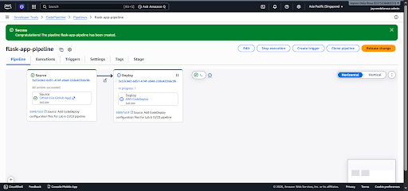

*First pipeline execution in progress after the pipeline was created*

The error message from the CodeDeploy agent logs said everything clearly:

```
Network error: Failed to open TCP connection to codedeploy-commands.ap-southeast-1.amazonaws.com:443 (execution expired)
```

The CodeDeploy agent was running on the instance. The IAM role was attached. The instance was healthy in the target group. But the agent could not reach the CodeDeploy service because the instance lives in a private subnet with no route to the internet.

The `ip route show` output confirmed it. The only routes on the instance were internal `10.0.2.x` addresses. There was no `0.0.0.0/0` route to the outside world because I had deleted the NAT Gateway after Lab 5 to save costs.

This became the central problem of Lab 6. The CodeDeploy agent needs outbound HTTPS access on port 443 to poll the CodeDeploy service for deployment instructions. Without a NAT Gateway or a working VPC endpoint, that connection is impossible from a private subnet.

I attempted to solve this with VPC Interface Endpoints for the CodeDeploy service, which would have been the cleaner and cheaper solution. The endpoints were created and showed as Available in the console, but the instance still could not reach the CodeDeploy endpoint. The `curl` test confirmed it was still trying to reach a public IP rather than routing through the endpoint. The security group and subnet association issues made the VPC endpoint approach too time-consuming to debug reliably.

The solution that worked was bringing the NAT Gateway back.

---

### The ASG Replacement Problem

While debugging the connectivity issue, I ran into a second problem that compounded everything. The ASG kept terminating and replacing instances. Every time an instance was terminated, whether by the ASG health check or by me manually, the replacement came from the old AMI without the CodeDeploy agent installed. This created a cycle where I would install the agent, the ASG would replace the instance, and the new instance would have no agent.

The correct fix was to bake the agent into an AMI and update the Launch Template so that every new ASG instance starts with the agent already installed. I did this multiple times across several AMI versions as the situation evolved.

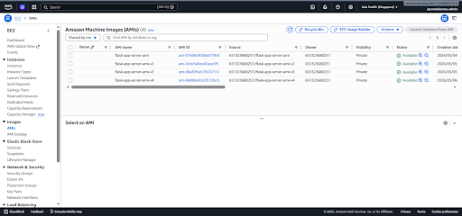

*One of several AMI versions created during the troubleshooting process, each capturing a progressively cleaner server state*

Each AMI cycle required updating the Launch Template to a new version and updating the ASG to use that version, then terminating the current instance to force the ASG to launch a fresh one from the new AMI. This process was repeated more times than I would like to admit.

---

### The File Conflict

Once the NAT Gateway was back and the agent could reach the CodeDeploy service, the pipeline ran and the lifecycle events started passing. `BeforeBlockTraffic` succeeded. `BlockTraffic` succeeded. `AfterBlockTraffic` succeeded. `ApplicationStop` succeeded. But then `Install` failed with a new error:

```
The deployment failed because a specified file already exists at this location: /home/ec2-user/file-upload-flask/.gitignore
```

The `file-upload-flask` folder already existed on the instance because it was cloned there during the original Lab 5 setup and baked into the AMI. CodeDeploy was trying to copy new files into that directory, but the existing files were in the way, even though `appspec.yml` specified `overwrite: true`.

The immediate fix was to SSH into the instance and manually remove the folder before retrying the pipeline. That worked, and the pipeline succeeded.

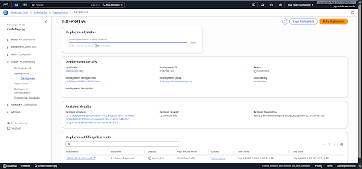

*CodeDeploy deployment showing all lifecycle events succeeded after the file conflict was resolved*

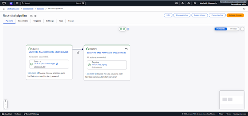

*CodePipeline showing both Source and Deploy stages green after the successful deployment*

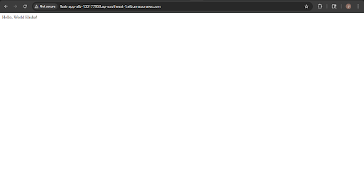

*App accessible via the ALB after the successful CodeDeploy deployment*

The permanent fix was to add `rm -rf /home/ec2-user/file-upload-flask` to `stop_flask.sh` so CodeDeploy would always clean up the old folder before copying new files. This was committed and pushed, and required yet another AMI cycle to bake the fix into the instance image so future instances would not have the same problem.

---

### Testing the CI/CD Pipeline

With the pipeline working, I tested the full CI/CD cycle by modifying `main.py` to change the hello world message and pushing the change to GitHub.

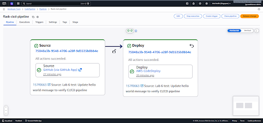

*Pipeline execution triggered after pushing the hello world code change to GitHub*

The pipeline triggered and both stages completed successfully. However, the updated message did not appear on the browser. Investigation showed the `main.py` on the server still had the original content dated April 26, which was the date of the original file baked into the AMI. The deployment had succeeded but the old file from the AMI was taking precedence over the newly deployed one.

This pointed to the same root cause as the `.gitignore` conflict: the `file-upload-flask` folder baked into the AMI was interfering with the deployment. The `rm -rf` fix in `stop_flask.sh` was supposed to resolve this, but the AMI that the current instance was launched from predated that fix.

Another AMI cycle was needed. But at this point, Finals week was approaching, the AWS bill was growing with each NAT Gateway creation, and May 9 was one day away. I made the decision to stop.

---

### The Decision to Stop and Clean Up

The combination of factors that led to stopping was straightforward. Finals week is near. The deadline was May 9. And each new attempt required another AMI cycle that could take 10 to 15 minutes just for the AMI to become available, before any actual debugging could happen.

Stopping was not giving up. It was the correct resource allocation decision given the constraints.

I deleted every Lab 6 resource: the CodePipeline, the CodeDeploy application, both IAM roles, all AMI versions created during Lab 6, all extra Launch Template versions, the NAT Gateway, the S3 bucket created by CodePipeline, and the GitHub repository. The ASG was restored to use the original Launch Template Version 1 with the original AMI. A new instance launched from that AMI, passed health checks, and the app returned to its Lab 5 state.

---

## 🔹 Final Verification

After cleanup, the infrastructure was confirmed back in its Lab 5 state. The ASG instance was running and healthy, the IAM role field was empty confirming the `EC2CodeDeployInstanceProfile` was removed, and the ALB was serving traffic correctly.

The app returned the original response, confirming the Lab 5 state was fully restored and no Lab 6 changes remained on the server.

---

## 🔹 Errors and Fixes Summary

| Error | Cause | Fix |
|---|---|---|
| `BeforeBlockTraffic` fails with `UnknownError` on every pipeline run | CodeDeploy agent cannot reach `codedeploy-commands.ap-southeast-1.amazonaws.com:443` because the private subnet has no internet route after NAT Gateway deletion | Recreated the NAT Gateway and added `0.0.0.0/0` route back to the private route table |
| ASG keeps launching new instances without the CodeDeploy agent | Every new instance launches from the original AMI which has no agent installed | Installed the CodeDeploy agent, created a new AMI, updated the Launch Template, and updated the ASG to use the new version |
| `Install` lifecycle event fails with file already exists at `.gitignore` location | The `file-upload-flask` folder already exists on the instance from Lab 5 setup baked into the AMI, and `overwrite: true` does not handle pre-existing files that are not in the deployment bundle | Manually removed the folder via SSH before retrying, then added `rm -rf /home/ec2-user/file-upload-flask` to `stop_flask.sh` as a permanent fix |
| Pipeline succeeds but old `main.py` content remains on the server | The instance was launched from an AMI that predated the `rm -rf` fix in `stop_flask.sh`, so the old folder from the AMI was still present when deployment ran | Required another AMI cycle to bake the fix in, which was not completed before the lab was stopped |
| VPC Interface Endpoints for CodeDeploy created but agent still cannot reach the service | Endpoint was available in the console but instance was still routing to a public IP, likely due to security group or subnet association misconfiguration | Abandoned VPC endpoint approach and used NAT Gateway instead |

---

## 🔹 Key Learnings

**1. Private subnets need a deliberate outbound strategy for every AWS service they talk to.**

The CodeDeploy agent needs to reach `codedeploy-commands.ap-southeast-1.amazonaws.com` on port 443. That is a public endpoint. An instance in a private subnet has no path to it without either a NAT Gateway or a properly configured VPC Interface Endpoint. This is not a Lab 6 problem specifically. It is a fundamental constraint of private subnet architecture that applies to any AWS service an instance needs to call. Before deploying any agent or service to a private subnet instance, the outbound network path needs to be planned explicitly.

**2. AMIs capture everything, including the problems.**

The `file-upload-flask` folder being present on every new instance was not a CodeDeploy bug. It was an AMI problem. The folder was cloned during Lab 5 setup and baked into the AMI before anyone thought about what CodeDeploy would do when it tried to deploy files to that same location. Every new instance launched from that AMI inherited the problem. The lesson is that what gets baked into an AMI matters as much as what gets deployed later. A clean AMI baseline, one where CodeDeploy-managed directories do not already exist, would have prevented the entire file conflict issue from the start.

**3. CI/CD infrastructure has its own deployment problem.**

Deploying a CI/CD pipeline requires deploying the CI/CD agent first. That agent needs network access. The agent needs to be baked into the AMI. The AMI needs to be registered in the Launch Template. The Launch Template needs to be set as the ASG default. A new instance needs to launch from it. Only then can the pipeline run. Each of these steps has a dependency on the previous one, and any failure at any step resets the cycle. Understanding the full dependency chain before starting would have saved significant time.

**4. Cost accumulates silently when troubleshooting infrastructure.**

The NAT Gateway cost per hour. The ALB cost per hour. RDS cost per hour. During a multi-day troubleshooting session, these costs compound in the background regardless of whether any progress is being made. Creating and deleting the NAT Gateway multiple times added data processing charges on top of the hourly rate. For a personal project with a hard budget constraint, having a clear plan before creating infrastructure, and a habit of deleting temporary resources immediately after use, is not optional. It is the difference between a $8 month and a $93 forecasted month.

**5. Knowing when to stop is part of engineering judgment.**

There is always one more thing to try. One more AMI cycle. One more pipeline run. One more tweak to `stop_flask.sh`. But engineering judgment includes recognizing when the cost of continuing exceeds the value of the result, especially under real constraints like a deadline, a budget, and competing priorities. Stopping, documenting what happened, cleaning up properly, and preserving the Lab 5 state was the right decision. The infrastructure is intact. The learnings are real. The documentation is honest. That is worth more than a green checkmark reached by exhausting every resource available.

---

## 🔹 Cleanup Performed

| Action | Reason |
|---|---|
| Deleted CodePipeline `flask-app-pipeline` | Lab 6 resource, no longer needed after stopping |
| Deleted CodeDeploy Application `flask-photo-app` including deployment group | Lab 6 resource, no longer needed after stopping |
| Deleted IAM Role `CodeDeployServiceRole` | Lab 6 resource, no longer needed |
| Deleted IAM Role `EC2CodeDeployInstanceProfile` | Lab 6 resource, no longer needed |
| Deregistered and deleted all Lab 6 AMI versions | Lab 6 resources, no longer needed. Original Lab 5 AMI kept intact |
| Deleted Lab 6 Launch Template versions, set default back to Version 1 | Restored Launch Template to Lab 5 state |
| Updated ASG to use Launch Template Version 1 | Restored ASG to Lab 5 state |
| Deleted NAT Gateway, removed route from private route table, released Elastic IP | NAT Gateway was temporary. Removed to stop hourly charges |
| Deleted S3 bucket created by CodePipeline | Lab 6 artifact storage bucket, no longer needed |
| Deleted all three GitHub App connections | Created during CodePipeline setup, no longer needed |
| Deleted GitHub repository `jayveedelarosa/file-upload-flask` | No longer needed after stopping Lab 6 |
| Deleted local `file-upload-flask` folder on Windows machine | Cleanup of local development files |
| Terminated current ASG instance to force fresh launch from original AMI | Ensured the running instance reflects the restored Lab 5 state |

---

## 🔹 What's Next

Lab 6 remains unfinished, and that is an honest outcome worth stating clearly. The CI/CD pipeline ran and deployed successfully at least once. The architecture is understood. The failure points are documented. If and when time and resources allow, the correct approach would be to start with a clean AMI that has no `file-upload-flask` folder present, install the CodeDeploy agent, bake it in, and build the pipeline from that clean baseline. The NAT Gateway would need to stay active for the duration of any pipeline testing, then be removed and replaced with a properly configured VPC Interface Endpoint for a permanent solution.

For now, the project stands at five completed labs covering everything from a single LightSail server to a fully auto-scaling cloud infrastructure. That is the foundation Sir Raphael's challenge was asking for, and it is a foundation I understand well enough to explain clearly.

---

*Documentation by Jayvee Dela Rosa | Based on the AWS Network Challenge 2 by [Raphael Jambalos](https://dev.to/raphael_jambalos/aws-network-challenge-2-deploy-a-file-uploading-app-on-ec2-rds-documentdb-16eb)*

